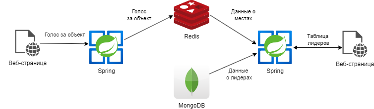

# Курсовая работа. Вариант 1
## Тема: Разработка веб-сервиса рейтинговой таблицы

### Концептуальная структура проекта

### Описание работы веб-сервиса

Создать приложение-голосование. В базе данных хранятся объекты, за которых можно голосовать. В Redis хранится текущий статус проведения голосования.

Первый веб-сервис:
1. Предоставляет веб-страницу пользователю со списком для голосования. Он представляет собой таблицу с порядковым номером, характеристиками объекта и кнопки «Проголосовать» около каждого из объектов. 
2. Принимает данные об отданном голосе, проверяет их и передаёт их в Redis.
3. Сообщает пользователю об успешном голосовании.

Второй веб-сервис:
1. Предоставляет пользователю веб-страницу с текущим ходом голосования.
2. Веб-страница содержит таблицу с тройкой лидеров голосования и количество голосов, отданных за каждого.
3. Таблица должна обновляться в режиме реального времени.

### Содержание отчёта
1. Титульный лист
2. Содержание
3. Введение
4. Структура проекта
5. Описание используемых технологий
6. Описание процесса разработки
7. Демонстрация работы
8. Вывод