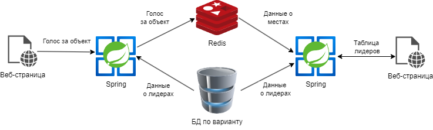
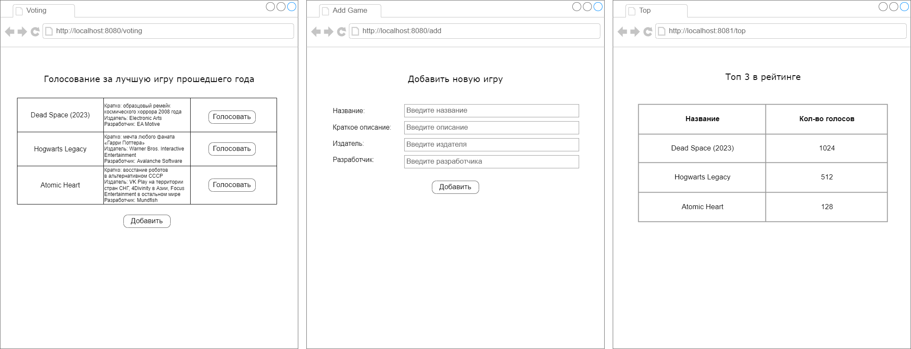

# Курсовая работа. Вариант 1
## Тема: Разработка веб-сервиса для полнотекстового поиска

### Концептуальная структура проекта

### Описание работы веб-сервиса

В рамках курсовой работы требуется создать приложение, предоставляющее возможность производить полнотекстовый поиск 
по документам заданной предметной области при помощи фреймворка Spring и ElasticSearch.

Создать веб-приложение, предоставляющее производить полнотекстовый поиск по документам по заданной предметной области при помощи фреймворка Spring и ElasticSearch.

Архитектура приложения включает в себя следующие элементы:
1. Страницу поиска объектов по содержанию. Сверху располагается поисковая строка и кнопка Найти. По центру располагается с таблицей с характеристиками найденных объектов (кроме содержания). Снизу должна находиться кнопка Добавить.
2. Страницу просмотра полной информации об объекте. На ней отображаются все характеристики объекта (включая содержание).
3. Страницу добавления нового объекта. На ней располагаются поля для ввода характеристик объекта (кроме id).
4. Полнотекстовый поиск должен происходить через ElasticSearch и поиск должен производиться по всем полям объекта, а не только по содержанию. Logstash тут использовать не нужно!!! Kibana используется опционально - если нужно посмотреть содержимое ElasticSearch. В курсовом расписать, что за поисковый алгоритм выбран, в чём его особенность и почему именно он нам подходит.
5. Логи работы приложения (о том, какой поисковый запрос был сделан) должны писаться в отдельный индекс в Elastic.

Примерный шаблон графического интерфейса. Использование стилей CSS в интерфейсе приветствуется:

### Содержание отчёта
1. Титульный лист
2. Содержание
3. Введение
4. Структура проекта
5. Описание используемых технологий
6. Описание процесса разработки
7. Демонстрация работы
8. Вывод

### Полезные источники информации
[Создание spring-приложения с веб-интерфесом](https://javarush.com/groups/posts/2537-chastjh-8-pishem-neboljhshoe-prilozhenie-na-spring-boot)

[Пример с шаблонизатором tymeleaf с выводом списка и формой ввода](https://www.geeksforgeeks.org/spring-boot-thymeleaf-with-example/)

[Подключение ElasticSearch к Spring](https://www.baeldung.com/spring-data-elasticsearch-tutorial)

[Видеоуроки по созданию Spring-приложений с нуля](https://www.youtube.com/watch?v=FyZFK4LBjj0&list=PL0lO_mIqDDFUYDRzvocu5EsFGBqPM7CIw&index=1&ab_channel=%D0%93%D0%BE%D1%88%D0%B0%D0%94%D1%83%D0%B4%D0%B0%D1%80%D1%8C)