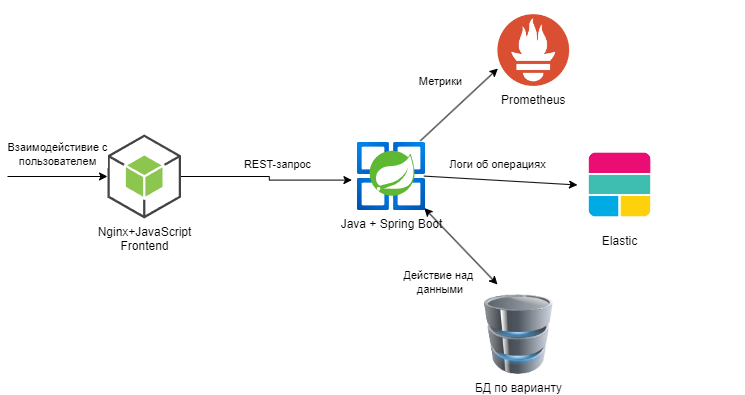

# Курсовая работа. Вариант 2
## Тема: Разработка одностраничного веб-сервиса

### Концептуальная структура проекта

### Описание работы веб-сервиса

В рамках курсовой работы требуется создать одностраничное приложение. **Single Page Application (SPA)** — это одностраничное приложение, сайт, который загружается целиком всего один раз. После этого все взаимодействия с пользователем происходят в одном окне браузера, а обновления контента выполняются динамически посредством JavaScript.

Архитектура приложения включает в себя следующие элементы:
1. Фронтенд-сервис, который представляет собой веб-приложение, написанное на языке JavaScript с применением фреймворков React/Vue/Svelte/Angular. В нём описывается вся логика взаимодействия с пользователем. Данный сервис взаимодействует с бэкендом через REST-запросы.
2. Фронтенд-сервис должен содержать страницу просмотра списка объектов с пагинацией.
3. Фронтенд-сервис должен содержать страницы добавления нового объекта и просмотра информации о единичном объекте.
4. Фронтенд-сервис может содержать и другие страницы, предусмотренные предметной областью.
5. Бэкенд сервис обрабатывает REST-запросы и записывает данные в базу. 
6. Логи об операциях (добавление объекта, просмотр объекта, обновление объекта, удаление объекта) на стороне бэкенда записываются в Elastic.
7. Метрики работы сервиса записываются в Prometheus. Отображение метрик в Grafana в данной работе можно не делать.

### Содержание отчёта
1. Титульный лист
2. Содержание
3. Введение
4. Структура проекта
5. Описание используемых технологий
6. Описание процесса разработки
7. Демонстрация работы
8. Вывод

### Полезные источники информации
[Создание приложения на React.js](https://tproger.ru/translations/react-basic-weather-app)

[Видеоуроки по созданию Spring-приложений с нуля](https://www.youtube.com/watch?v=FyZFK4LBjj0&list=PL0lO_mIqDDFUYDRzvocu5EsFGBqPM7CIw&index=1&ab_channel=%D0%93%D0%BE%D1%88%D0%B0%D0%94%D1%83%D0%B4%D0%B0%D1%80%D1%8C)