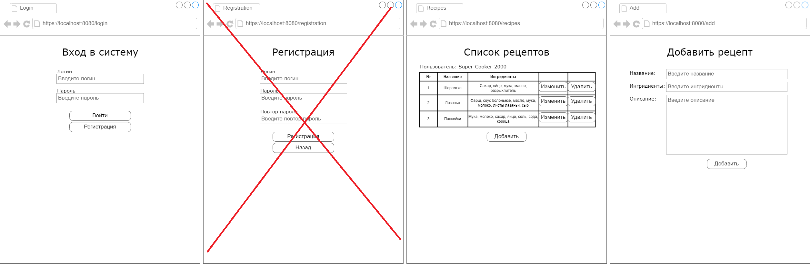

# Курсовая работа. Вариант 2
## Тема: Разработка веб-сервиса с аутентификацией

### Концептуальная структура проекта

### Описание работы веб-сервиса

Создать приложение с использованием аутентификации и логированием.

Веб-сервис:
1. Принимает запросы от пользователя, содержащие данные о пользователе и об объекте.
2. Проводит аутентификацию пользователя через Redis.
3. Читает/записывает/изменяет/удаляет данные в Cassandra.
4. На каждое действие пользователя формируется соответствующий лог и отправляется в Elastic.

Примерный шаблон графического интерфейса:

### Содержание отчёта
1. Титульный лист
2. Содержание
3. Введение
4. Структура проекта
5. Описание используемых технологий
6. Описание процесса разработки
7. Демонстрация работы
8. Вывод