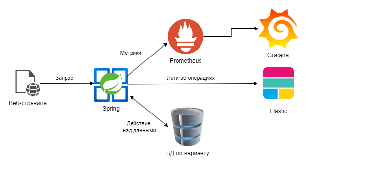
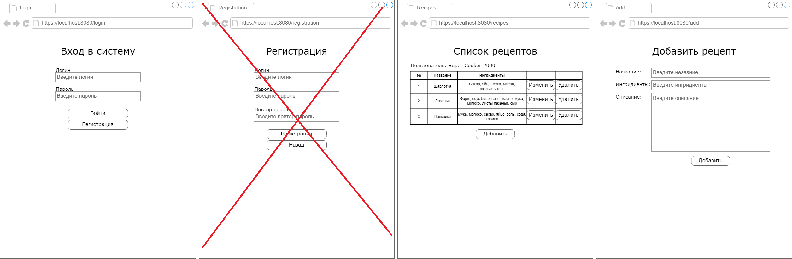

# Курсовая работа. Вариант 2
## Тема: Разработка веб-сервиса для полнотекстового поиска

### Концептуальная структура проекта

### Описание работы веб-сервиса

Создать веб-приложение, предоставляющее производить оплнотекстовый поиск по документам по заданной предметной области при помощи фреймворка Spring и ElasticSearch.

Веб-сервис:
1. Позволяет добавлять информацию о новом объекте в базу данных.
2. Позволяет просматривать полную информацию о конкретном объекте.
3. Позволяет искать нужный объект по ключевым словам, задаваемым в поле поиска.

Примерный шаблон графического интерфейса:

### Содержание отчёта
1. Титульный лист
2. Содержание
3. Введение
4. Структура проекта
5. Описание используемых технологий
6. Описание процесса разработки
7. Демонстрация работы
8. Вывод

### Полезные источники информации
[Создание спринг-приложения с веб-интерфесом](https://javarush.com/groups/posts/2537-chastjh-8-pishem-neboljhshoe-prilozhenie-na-spring-boot)

[Пример с шаблонизатором tymeleaf с выводом списка и формой ввода](https://www.geeksforgeeks.org/spring-boot-thymeleaf-with-example/)

[Подключение ElasticSearch к Spring](https://www.baeldung.com/spring-data-elasticsearch-tutorial)