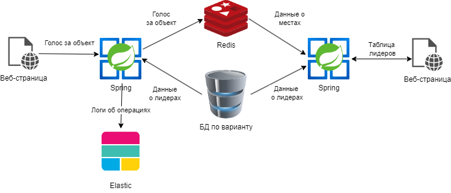
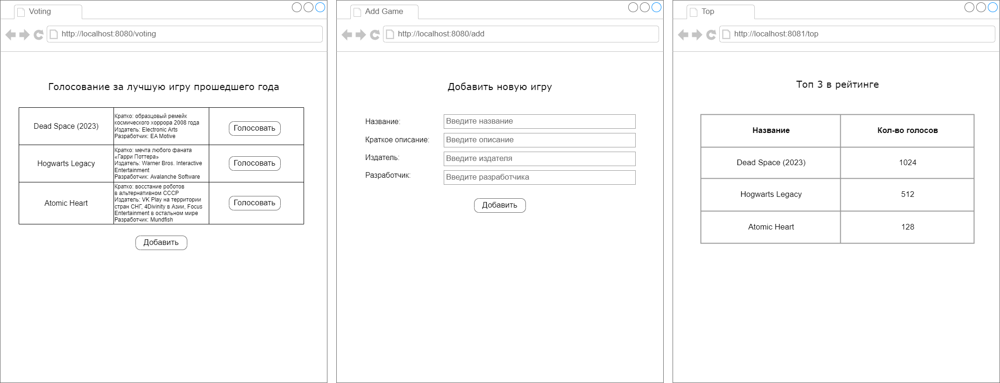

# Курсовая работа. Вариант 4
## Тема: Разработка веб-сервиса рейтинговой таблицы

### Концептуальная структура проекта


### Описание работы веб-сервиса

В рамках курсовой работы требуется создать приложение, реализующее функцию голосования c аутентификацией.

Архитектура приложения включает в себя следующие элементы:
1. Базу данных (по варианту) для хранения объектов, по которым будет производиться голосования.
2. Базу данных Redis для хранения данных о ходе прохождения согласования. Данные хранятся в SortedSet. Ключом является id объекта, значением - количество голосов за этот объект. Сортировка производиться по количеству голосов по возрастанию.
3. Первый веб-сервис предоставляет пользователю список объектов для осуществления голосования в виде таблицы. 
Каждая запись таблицы включает в себя порядковый номер, характеристики объекта и кнопку Проголосовать. При нажатии на кнопку Проголосовать веб-сервис принимает данные о голосе, проверяет их, передает для последующего сохранения в Redis, сообщает пользователю о результатах сохранения голосования.
4. Первый веб-сервис также содержит Страницу аутентификации. На ней пользователь вводит логин и пароль и входит в систему. Аутентификацию не обязательно делать через Spring Security, можно сделать просто обработчик этой страницы, который просто проверит, что пользователь с таким логином и паролем есть в базе данных.
5. Первый веб-сервис также содержит Страницу добавления нового пользователя. На ней пользователь вводит логин и пароль и нажимает кнопку Зарегистрироваться. При нажатии на кнопку проверяется, что пользователя с таким логином нет в базе данных и что пароль совпадает с повтором пароля. Если проверки пройдены, пользователь добавляется в базу данных.
6. Второй веб-сервис предоставляет пользователю данные о текущем ходе согласования на веб-странице в виде таблицы.
Каждая запись таблицы включает в себя информацию о первых трех лидерах голосования (название и кол-во голосов). Веб-страница должна обновляться в режиме реального времени.

Примерный шаблон графического интерфейса:



### Содержание отчёта
1. Титульный лист
2. Содержание
3. Введение
4. Структура проекта
5. Описание используемых технологий
6. Описание процесса разработки
7. Демонстрация работы
8. Вывод

### Полезные источники информации
[Создание спринг-приложения с веб-интерфесом](https://javarush.com/groups/posts/2537-chastjh-8-pishem-neboljhshoe-prilozhenie-na-spring-boot)

[Пример с шаблонизатором tymeleaf с выводом списка и формой ввода](https://www.geeksforgeeks.org/spring-boot-thymeleaf-with-example/)

[Пример подключения к Redis (нам нужен пункт про HashOperations)](https://www.concretepage.com/spring-4/spring-data-redis-example)

[Видеоуроки по созданию Spring-приложений с нуля](https://www.youtube.com/watch?v=FyZFK4LBjj0&list=PL0lO_mIqDDFUYDRzvocu5EsFGBqPM7CIw&index=1&ab_channel=%D0%93%D0%BE%D1%88%D0%B0%D0%94%D1%83%D0%B4%D0%B0%D1%80%D1%8C)

### Пример обновления информации на странице
Сделаем в Spring компонент со счётчиком. У него будет поле counter с числовым значением. Этот компонент мы будем отдавать на веб-страницу.
```java
@Component
public class Counter {
    private int counter = 0;

    public void inc() {
        counter++;
    }

    public int getCounter() {
        return counter;
    }
 }
```

Сделаем контроллер, который по GET-запросу будет инкрементировать счётчик и отдавать клиенту ответ в виде json. Обязательно над классом нужно добавить аннотацию `@CrossOrigin`, чтобы иметь возможность запрашивать данные с веб-странички.
```java
@CrossOrigin
@RestController
@RequestMapping("/counter")
public class MainController {
    @Autowired
    private Counter counter;

    @GetMapping
    public ResponseEntity<Counter> incrementAndGetCounter() {
        counter.inc();
        return ResponseEntity.ok(counter);
    }
}
```

Создадим веб-страницу, которая запрашивает данные с сервера с помощью JavaScript.
```html
<!DOCTYPE html>
<html lang="en">
<head>
    <meta charset="UTF-8">
    <title>Counter</title>
</head>
<body>
    <!-- В теле выбираем элемент, куда будем записывать информацию, полученную с сервера -->
    <!-- Задаём ему какое-нибудь id для последующего поиска по нему -->
    <h1 id="app"/>
</body>
<!-- Пишем код, который запрашивае данные с сервера и отображат их на странице -->
<script>
    // Объявляем функцию, которая будет запрашивать данные с сервера
    function fetchData() {
        // С помощью встроенной функции fetch запрашиваем данные по url
        fetch('http://localhost:8080/counter')
        // Получаем ответ берём из него тело в формате json (В данном случае это будет: {"counter": 1})
         .then(resp => resp.json())
        // Записываем информацию из json в элеметн html
         .then(json => {
            // Получаем элемент по его id='app' и устанавливаем его текст (берём значение поля counter из json)
            document.getElementById('app').textContent = json.counter;
         });
    }

    // Для того, чтобы запрашивать данные каждую секунду, используем функцию setInterval
    // Эта функция будет каждую секунду запускать fethData
    setInterval(fetchData , 1000);
</script>
</html>
```