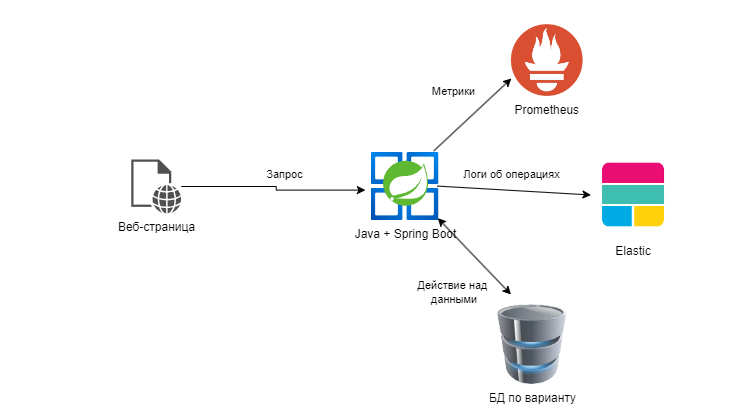
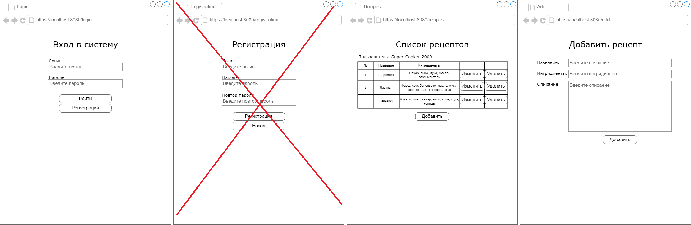

# Курсовая работа. Вариант 5
## Тема: Разработка веб-сервиса на Spring Boot

### Концептуальная структура проекта

### Описание работы веб-сервиса

В рамках курсовой работы требуется создать многостраничное приложение, реализующее функции аутентификации и логирования. **Multi Page Application (MPA)** — это многостраничные приложения, которые работают по традиционной схеме. Это означает, что при каждом незначительном изменении данных или загрузке новой информации страница обновляется.

Архитектура приложения включает в себя следующие элементы:
1. Страницу аутентификации. На ней пользователь вводит логин и пароль и входит в систему. Аутентификацию не обязательно делать через Spring Security, можно сделать просто обработчик этой страницы, который просто проверит, что пользователь с таким логином и паролем есть в базе данных.
2. Страницу добавления нового пользователя. На ней пользователь вводит логин и пароль и нажимает кнопку Зарегистрироваться. При нажатии на кнопку проверяется, что пользователя с таким логином нет в базе данных и что пароль совпадает с повтором пароля. Если проверки пройдены, пользователь добавляется в базу данных.
3. Страницу списка объектов с характеристиками в виде таблицы. Над таблице должно располагаться имя пользователя, под которым он вошёл. В таблицы должны быть кнопки Изменить и Удалить объект. Под таблицей должна быть кнопка добавить новый объект.
4. Страницу добавления нового объекта. Должна содержать все поля (кроме id) для ввода информации о новом объекте. Внизу должна быть кнопка Добавить.
5. Страницу изменения существующего объекта. Должна содержать все поля (кроме id) для изменения информации о существующем объекте. Внизу должна быть кнопка Изменить.
6. Другие страницы, необходимые для предметной области.
7. Базу данных по варианту для хранения информации об объектах.
8. В сервисном слое на каждое действие пользователя формируется соответствующий лог и отправляется в Elastic. (Пример: `log.info("Пользователь id='%s' добавил рецепт с id='%s', userId, recepieId);`)
9. Метрики сервиса передаются в Prometheus. Нужно придумать несколько своих метрик (Пример: количество рецептов, среднее время поиска рецепта в базе).
10. Придумать логику работы веб-сервиса (например, чтобы рецепты сопоставлялись с авторами; либо же системы лайков и репостов рецептов на страницах пользователей либо что-то ещё).

Примерный шаблон графического интерфейса:

### Содержание отчёта
1. Титульный лист
2. Содержание
3. Введение
4. Структура проекта
5. Описание используемых технологий
6. Описание процесса разработки
7. Демонстрация работы
8. Вывод

### Полезные источники информации
[Создание спринг-приложения с веб-интерфесом](https://javarush.com/groups/posts/2537-chastjh-8-pishem-neboljhshoe-prilozhenie-na-spring-boot)

[Пример с шаблонизатором tymeleaf с выводом списка и формой ввода](https://www.geeksforgeeks.org/spring-boot-thymeleaf-with-example/)

[Пример аутентификации](https://www.javaguides.net/2020/06/spring-security-tutorial-with-spring-boot-spring-data-jpa-thymeleaf-and-mysql-database.html)

[Видеоуроки по созданию Spring-приложений с нуля](https://www.youtube.com/watch?v=FyZFK4LBjj0&list=PL0lO_mIqDDFUYDRzvocu5EsFGBqPM7CIw&index=1&ab_channel=%D0%93%D0%BE%D1%88%D0%B0%D0%94%D1%83%D0%B4%D0%B0%D1%80%D1%8C)