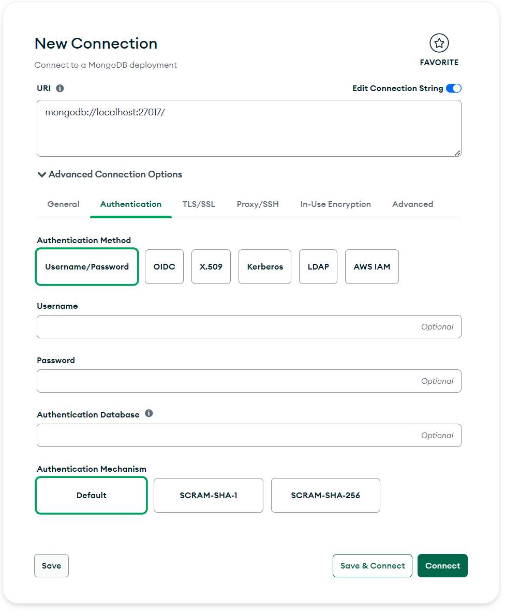
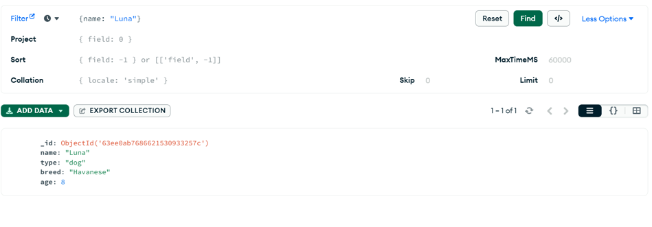

# Лабораторная работа 1
## Тема: Работа с брокером сообщения Kafka

**Цель:** Изучение основ документоориентированной СУБД MongoDB

### 1. Основы MongoDB

Базовым компонентом MongoDB является документ, очень похожий на JSON. Технически это BSON, который содержит некоторые дополнительные данные (например, datetime), которые недопустимы в JSON.

Мы можем рассматривать документ как запись в реляционной базе данных. Документы помещаются в коллекции, которые соответствует концепции таблиц в реляционной базе данных. 

Коллекции хранятся в базах данных.

Подробная информация о MongoDB представлена на официальном сайте: https://www.mongodb.com 


### 2. Compass

Для подключение к серверу MongoDB и взаимодействия с ним существует Compass. Он позволяет взаимодействовать с MongoDB через графический интерфейс, подключаться к ней и писать запросы.


### 3. Запуск сервера MongoDB через Docker

Для запуска сервера через докер можно ввести команду
```bash
docker run --name my-mongo -dit -p 27017:27017 -rm mongo:latest
```


### 4. Подключение к серверу

Для подключение к серверу в Compass нужно ввести следующий URL: `mongodb://localhost:27017`

При необходимости нужно открыть Advanced Connection Options и ввести логин, пароли и базу данных для подключения.




### 5. Начало работы

Для написания всех команд, описанных далее существует терминал. Он расположен в нижней части окна Compass.

Для того, чтобы посмотреть все базы данных, можно ввести команду:
```
>>> show dbs

admin   40.00 KiB
config  60.00 KiB
local   40.00 KiB
```

Узнать имя текущей базы данных:
```
>>> db

test
```

Для переключение на другую коллекцию есть команда `use`. Если базы с таким именем нет, то она создастся автоматически.
```
>>> use <db-name>
>>> use admin
>>> use pets

'switched to db pets'
```


### 6. Добавление документов

Добавление документа в коллекцию
```js
>>> db.pets.insertOne({name: "Luna", type: "dog", breed: "Havanese", age: 8})

{
  acknowledged: true,
  insertedId: ObjectId("63ee0ab7686621530933257c")
}
```

В Compass при нажатии на кнопку обновления появится новый созданный документ:



Добавление нескольких документов в коллекцию. Тут добавляется массив из 1000 элементов.
```js
>>> db.pets.insertMany(
  Array.from({ length: 10000 }).map((_, index) => ({
    name: ["Luna", "Fido", "Fluffy", "Carina", "Spot", "Beethoven", "Baxter", "Dug", "Zero", "Santa's Little Helper","Snoopy",][index % 9],
    type: ["dog", "cat", "bird", "reptile"][index % 4],
    age: (index % 18) + 1,
    breed: [ "Havanese", "Bichon Frise", "Beagle", "Cockatoo", "African Gray", "Tabby", "Iguana",][index % 7], index: index,
  }))
);
```


### 7. Поиск документов

Поиск документов осуществляется функциями `find` и `findOne`. Внутри функций указываются фильтры, по которым надо производить поиск.
```js
// Вернуть первую запись в коллекции
>>> db.pets.findOne();

{
  _id: ObjectId("63ee0ab7686621530933257c"),
  name: 'Luna',
  type: 'dog',
  breed: 'Havanese',
  age: 8
}

// Вернуть первую запись, подходящую под условие
>>> db.pets.findOne({ index: 3 });

{
  _id: ObjectId("63ee0f3d6866215309332580"),
  name: 'Carina',
  type: 'reptile',
  age: 4,
  breed: 'Cockatoo',
  index: 3
}

// Вернуть первую запись, подходящую под условие
>>> db.pets.findOne({ name: "Spot", type: "dog" });

{
  _id: ObjectId("63ee0f3d6866215309332581"),
  name: 'Spot',
  type: 'dog',
  age: 5,
  breed: 'African Gray',
  index: 4
}

// Вернуть все записи в коллекции, подходящие под условие
>>> db.pets.find({ type: "dog" });

{
  _id: ObjectId("63ee0ab7686621530933257c"),
  name: 'Luna',
  type: 'dog',
  breed: 'Havanese',
  age: 8
}
{
  _id: ObjectId("63ee0f3d686621530933257d"),
  name: 'Luna',
  type: 'dog',
  age: 1,
  breed: 'Havanese',
  index: 0
}
```

Для подсчёта числа документов в коллекции есть функция `countDocuments` и `count`:
```js
// Количество документов в коллекции
>>> db.pets.countDocuments();
10000

// Количество документов в коллекции, подходящих под условие
>>> db.pets.count({ type: "dog" });
2501
```

Для ограничения числа документов в результате есть функция `limit`. Для "пролистывания" документов из коллекции есть оператор `it`. Примеры использования:
```js
// Ограничение результата
>>> db.pets.find({ type: "dog" }).limit(40);
... выведется 20 документов
>>> it
... выведется ещё 20 документов
>>> it
no cursor
```

Материализация запроса (преобразование результата (курсора) в массив данных) осуществляется функцией `toArray`.
```js
// Материализация запроса
>>> db.pets.find({ type: "dog" }).limit(40).toArray();
[
  {
    _id: ObjectId("63ee0ab7686621530933257c"),
    name: 'Luna',
    type: 'dog',
    breed: 'Havanese',
    age: 8
  },
  ...
]
```

Операторы запроса:
- `$gt` - greater than
- `$gte` - greater than or equal to
- `$lt` - less than
- `$lte` - less than or equal to
- `$eq` - equals (не обязательно)
- `$ne` - not equals
- `$in` – содержится в массиве
- `$nin` – не содержится в массиве

Пример:
```js
// Оператор $gt
>>> db.pets.count({ type: "cat", age: { $gt: 12 } });
833

// Оператор $ne
>>> db.pets.find({ type: { $ne: "dog" }, name: "Fido",});
... результаты поиска

// Логический оператор "И"
>>> db.pets.find({
  type: "bird",
  $and: [
    { age: { $gte: 4 } }, 
    { age: { $lte: 8 } }
  ],
});
... результаты поиска
```


### 8. Сортировка и проекция

Для сортировки существует функция `sort`. В ней указывается, по какому полю производить сортировку и в каком порядке. 1 - сортировка по возрастанию. -1 - сортировка по убыванию.
```js
// Сортировка по убыванию
>>> db.pets.find({ type: "dog" }).sort({ age: -1 });
... результаты поиска
```

Для проекции добавляется ещё один блок в функцию `find`. Для исключения полей указывается значение false или 0. Для включения полей указывается значение true или 1. Поле _id автоматически включается в каждый результат. Для его отключения нужно явно указать id: 0.
```js
// Проекция по полям _id, name и breed
>>> db.pets.find({ type: "dog" }, { name: 1, breed: 1 });
{
  _id: ObjectId("63ee0ab7686621530933257c"),
  name: 'Luna',
  breed: 'Havanese'
}
...

// Проекция по полям name и breed
>>> db.pets.find({ type: "dog" }, { name: 1, breed: 1, _id: 0 });
{
  name: 'Luna',
  breed: 'Havanese'
}
...

// Проекция с true и false
>>> db.pets.find({ type: "dog" }, { name: true, breed: true, _id: false });
{
  name: 'Luna',
  breed: 'Havanese'
}
...

// Проекция со всеми полями, кроме _id
>>> db.pets.find({ type: "dog" }, { _id: 0 });
{
  name: 'Luna',
  type: 'dog',
  breed: 'Havanese',
  age: 8
}
...
```


### 9. Обновление данных

Для обновления данных существуют функции `updateOne` и `updateMany`. Первым параметром указывается фильтр, по которому отбираются записи на обновление. Вторым параметром указывается поля, которые нужно поменять через оператор `$set`. Для увеличения значения на 1 можно применить оператор `$inc`.
```js
// Обновление поля owner через оператор $set
>>> db.pets.updateOne(
  { type: "dog", name: "Luna", breed: "Havanese" },
  { $set: { owner: "Brian Holt" } }
);

{
  acknowledged: true,
  insertedId: null,
  matchedCount: 1,
  modifiedCount: 1,
  upsertedCount: 0
}

// Обновление поля age через оператор $inc
>>> db.pets.updateMany({ type: "dog" }, { $inc: { age: 1 } });

{
  acknowledged: true,
  insertedId: null,
  matchedCount: 2501,
  modifiedCount: 2501,
  upsertedCount: 0
}
```


### 10. Удаление данных

Для удаления данных есть функции `deleteOne` и `deleteMany`. В параметрах указываются фильтры, по которым удаляются записи.
```js
>>> db.pets.deleteOne({ type: "dog" });
{
  acknowledged: true,
  deletedCount: 1
}

>>> db.pets.deleteMany({ type: "reptile", breed: "Havanese" });
{
  acknowledged: true,
  deletedCount: 357
}
```
