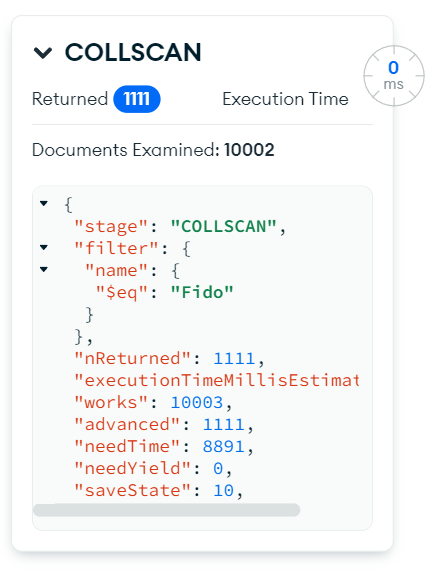
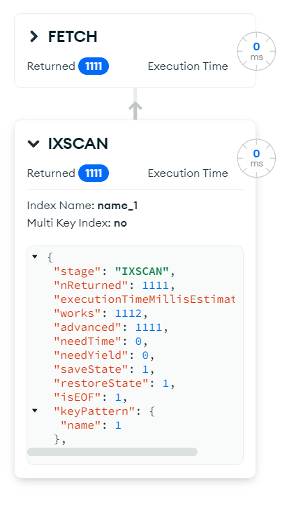

# Лабораторная работа 2
## Тема: Индексы и агрегации в MongoDB

**Цель:** Изучение применения и специфики индексов в MongoDB. Составление сложных запросов при помощи агрегаций.

### 1. Понятие и применение индекса

Индексы — это отдельная структура данных, которую поддерживает база данных для быстрого поиска.

Компромисс здесь заключается в том, что индексы могут привести к тому, что вставки, обновления и удаления будут немного медленнее, потому что они также должны обновлять индексы, а также занимать больше места на диске. Но взамен вы получаете очень быстрые запросы.

Рассмотрим простой запрос:
```js
db.pets.find({ name: "Fido" });
```

На уровне базы данных этот запрос будет просматривать каждый документ в базе и искать соответствие. Если в базе миллионы или сотни миллионов строк, то такой запрос будет работать очень медленно. Для того, чтобы убедиться в том, что запрос будет исполняться как показано выше, воспользуемся функцией `explain`.
```js
db.pets.find({ name: "Fido" }).explain("executionStats");
```

Функция `explain` предназначено для того, чтобы посмотреть план запроса. В результате выполнения запроса получим следующий ответ:



В данном случае мы видим, что в качестве поисковой стратегии будет использована стратегия COLLSCAN. Она имеет линейную сложность O(n).

Теперь попробуем создать *простой индекс* для этого поля. С этим нам поможет функция `createIndex`.
```js
dp.pets.createIndex({ name: 1 });
```



Теперь у нас появляются две стадии выполнения запроса. Первая стадия - IXSCAN - это сканирование индексной структуры и поиск в ней ссылок на нужные записи. Вторая стадия - FETCH - это чтение нужных документов из коллекции. За счёт такого подхода время поиска существенно сокращается.


### 2. Виды индексов

Если вы часто для поиска используете два ключа вместе, например тип и породу собаки, вы можете использования *составной индекс*. Поиск по данным индексам вместе будет работать быстрее, нежели если делать два индекса отдельно.
```js
dp.pets.createIndex({ name: 1, breed: 1 });
```

Если значения в поле уникальное для всей коллекции, то можно создать *уникальный индекс*. Он будет более эффективно работать для уникальных полей, поскольку для такого индекса будет смотреться только одна единственная запись (тут index - это название поля из коллекции).
```js
dp.pets.createIndex({ index: 1 }, { unique: true });
```

Индексы можно располагать в порядке *по возрастанию* и *по убыванию*. Выбор упорядочивания индекса зависит от задач.
```js
// Индекс по возрастанию
dp.pets.createIndex({ name: 1 });

// Индекс по убыванию
dp.pets.createIndex({ name: -1 });
```

Следующим типом индексов является *полнотекстовый индекс*. Такой индекс может быть только один на всю коллекцию. Он используется запросах полнотекстового поиска. Пример создания такого индекса для трёх полей: тип, порода и имя.
```js
db.pets.createIndex({
  type: "text",
  breed: "text",
  name: "text",
});
```

Полнотекстовые запросы в MongoDB выполняются с помощью оператора $text.
```js
// Простое совпадение, без сортировки по точности совпадения:
db.pets.find({$text: { $search: "dog Havanese Luna" }});


// Точное совпадение ближе к началу результата:
db.pets
  .find({$text: { $search: "dog Havanese Luna" }})
  .sort({score: { $meta: "textScore" }});
```

В MongoDB работают операторы маркеры как в поисковой системе Google. Если вы хотите найти всех Luna, которые не являются кошками:
```js
db.pets
  .find({$text: { $search: "-cat Luna" }})
  .sort({score: { $meta: "textScore" }});
```


### 3. Виды агрегаций

Операции агрегации обрабатывают записи данных и возвращают вычисленные результаты. 

Операции агрегации группируют значения из нескольких документов вместе и могут выполнять различные операции над сгруппированными данными для возврата одного результата. 

В SQL count (*) и с group by является эквивалентом агрегации mongodb.

MongoDB предоставляет три способа выполнения агрегации: pipeline, Map-Reduce и одноцелевые методы агрегирования. Рекомендованный вариант - pipeline.
- `pipeline` - фреймворк для агрегации в MongoDB моделирует концепцию обработку данных с помощью pipeline. Документы вводят многоэтапный конвейер, который преобразует документы в агрегированный результат.
- `map-reduce` - это алгоритм предложенный гугл для обработки больших данных. Тут все довольно просто есть две функции одна map, которая удаляет поля в документах по определенным признакам и группирует их и функция reduce, которая может свернуть значение сгруппированных документов.
- `одноцелевая агрегация` - это агрегация одной коллекции по определенному ключу.


### 4. Pipeline агрегации

Pipeline представляет собой массив из последовательно расположенных в нём операторов агрегаций. Каждый из операторов отвечает за какое-то действие. Эти действия выполняются последовательно и в результате получается какой-то выходной набор данных. Вот некоторые из операторов агрегаций:

- `$match`: используется для фильтрации документов, может уменьшить количество документов, которые передаются в качестве входных данных для следующего этапа.
- `$project`: используется для выбора некоторых конкретных полей из коллекции.
- `$group`: используется для группировки документов на основе некоторого значения.
- `$sort`: используется для сортировки документа, который их переставляет
- `$skip`: используется для пропуска n количества документов и пропускает остальные документы
- `$limit`: используется для передачи первых n документов, тем самым ограничивая их.
- `$unwind`: используется для разматывания документов, использующих массивы, т. е. деконструирует поле массива в документах, чтобы возвращать документы для каждого элемента.
- `$out`: используется для записи результирующих документов в новую коллекцию

Самый простой пример агрегации, которая будет выводить только документы с типом "dog" выглядит так:
```js
>>> db.pets.aggregate([
    {
        $match: {
            type: "dog"
        }
    }
]);

{
  _id: ObjectId('66e1c4be1d5da96a4b8fd584'),
  name: 'Luna',
  type: 'dog',
  breed: 'Havanese',
  age: 8
}
```

Давайте сделаем аналог group by и посчитает, сколько у нас животных каждого типа. У оператора group первое поле всегда _id. В нём мы указываем, по какому значению будем группировать. `"$type"` - это указатель на значение поля type.
```js
>>> db.pets.aggregate([
    {
        $group: {
            _id: "$type",
            count: {$count: {}}
        }
    }
]);

{ _id: 'dog', count: 2502 }
{ _id: 'cat', count: 2500 }
{ _id: 'bird', count: 2500 }
{ _id: 'reptile', count: 2500 }
```

По полю _id не очень понятно, что там лежит. Давайте добавим этап, на котором мы переименуем это поле. Дополнительно ещё одним этапом добавим сортировку сначала по количеству, а потом по типу.
```js
>>> db.pets.aggregate([
        {
            $group: {
                _id: "$type",
                count: {$count: {}}
            }
        },
        {
            $project: {
                _id: 0,
                type: "$_id",
                count: 1
            }
        },
        {
            $sort: {
                count: 1,
                type: 1
            }
        }
    ]
);

{ count: 2500, type: 'bird' }
{ count: 2500, type: 'cat' }
{ count: 2500, type: 'reptile' }
{ count: 2502, type: 'dog' }
```

Разбить всех собак на бакеты по возрасту можно следующим образом (функций `toArray` добавлена, чтобы получить результат в виде массива):
```js
>>> db.pets.aggregate([
  {
    $match: {
      type: "dog",
    },
  },
  {
    $bucket: {
      groupBy: "$age",
      boundaries: [0, 3, 9, 15],
      default: "very senior",
      output: {
        count: { $sum: 1 },
      },
    },
  },
]).toArray();

[
  { _id: 0, count: 278 },
  { _id: 3, count: 835 },
  { _id: 9, count: 834 },
  { _id: 'very senior', count: 555 }
]
```

Теперь давайте создадим новую коллекцию и добавим туда несколько владельцев животных:
```js
>>> db.owners.find();

{
  _id: ObjectId('66f53ee6f7c3376009aea991'),
  name: 'Ivanov Ivan Ivanovich',
  pets: [
    {
      index: 1
    },
    {
      index: 3
    },
    {
      index: 4
    }
  ]
}
{
  _id: ObjectId('66f53efbf7c3376009aea993'),
  name: 'Petrov Ivan Ivanovich',
  pets: [
    {
      index: 7
    }
  ]
}
```

Давайте выведем всех владельцев вместе с полной информацией об их питомцах. Для соединения двух документов служит оператор `$lookup`. Он работает как left join в SQL.
```js
>>> db.owners.aggregate([
  {
    $lookup: {
      from: "pets",
      localField: "pets.index",
      foreignField: "index",
      as: "pets_info"
    }
  },
  {
    $project: {
      pets: 0,
      "pets_info._id": 0,
      "pets_info.index": 0,
    }
  }
]);

{
  _id: ObjectId('66f53ee6f7c3376009aea991'),
  name: 'Ivanov Ivan Ivanovich',
  pets_info: [
    {
      name: 'Fido',
      type: 'cat',
      age: 2,
      breed: 'Bichon Frise'
    },
    {
      name: 'Carina',
      type: 'reptile',
      age: 4,
      breed: 'Cockatoo'
    },
    {
      name: 'Spot',
      type: 'dog',
      age: 5,
      breed: 'African Gray'
    }
  ]
}
{
  _id: ObjectId('66f53ee6f7c3376009aea991'),
  name: 'Ivanov Ivan Ivanovich',
  pets_info: [
    {
      name: 'Fido',
      type: 'cat',
      age: 2,
      breed: 'Bichon Frise'
    },
    {
      name: 'Carina',
      type: 'reptile',
      age: 4,
      breed: 'Cockatoo'
    },
    {
      name: 'Spot',
      type: 'dog',
      age: 5,
      breed: 'African Gray'
    }
  ]
}
```

Таким образом можно создавать запросы любой сложность в MongoDB.


### Map-Reduce

В операции map-reduce MongoDB применяет этап map к каждому входному документу (т.е. документам в коллекции, которые соответствуют условию запроса). Функция map генерирует пары "ключ-значение". Для тех ключей, которые имеют несколько значений, MongoDB применяет этап reduce, который собирает и обрабатывает агрегированные данные. Затем результаты сохраняются в коллекцию. При желании вывод функции reduce может пройти через функцию finalize для дальнейшего сжатия или обработки результатов агрегации.

Все функции map-reduce в MongoDB написаны на JavaScript и выполняются в процессе mongod. Операции map-reduce используют документы одной коллекции в качестве входных данных и могут выполнять любое произвольное сортирование и ограничение перед началом этапа map. Функция mapReduce может возвращать результаты операции map-reduce в виде документа или записывать результаты в коллекции.


### Индивидуальное задание

Задание:

1.	Скачать программу по генерации документов для MongoDB на языке Java
2.	Изучить код программы, настроить подключение к серверу MongoDB, задать название базы данных и коллекции.
3.	Изменить код программы таким образом, чтобы он генерировал документы по выбранной вами предметной области.
4.	Перед загрузкой документов в базу данных вывести тестовые данные в консоль (запустив функцию writeToConsole) и сделать скрин.
5.	Загрузить данные в MongoDB функцией writeToDatabase. Сделать скрин того, что документы в базу данных добавились (через компас или через Java сделать запрос documentCount).
6.	Выделить поля, по которым в вашей предметной области наиболее часто будут производиться запросы.
7.	С помощью запроса explain по вышеуказанным полям проанализировать время выполнения запроса (executionTimeMillis), способ его выполнения (executionStages->stage) и количество просканированных документов (totalDocsExamined).
8.	Создать индексы для вышеуказанных полей.
9.	С помощью запроса explain по вышеуказанным полям, которые теперь проиндексированы, проанализировать время выполнения запроса, способы его выполнения (их теперь будет два) и количество просканированных документов. Как изменились эти параметры?
10.	Выполнить четыре запроса на агрегацию. Каждая агрегация должна состоять как минимум из 3-х этапов.  Текстом написать, что должна выводить каждая агрегация. Представить описание запроса, сам запрос и его результаты.
