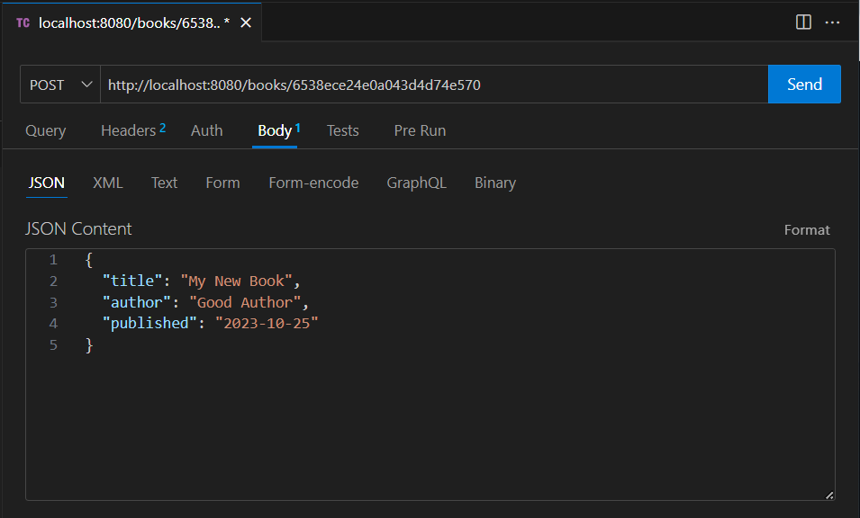

# Лабораторная работа 3
## Тема: Интеграция Spring Boot приложения с базой данных MongoDB

**Цель:** Изучение построения веб-сервисов по технологии REST на базе языка Java, фреймворка Spring Boot и No-SQL базы данных MongoDB.

### 1. Создание Spring Boot проекта
 
Для создания шаблона Spring-приложения существует специальный веб-сервис Spring Initializr. В нём можно перечислить основные компоненты конфигурации приложения. Веб-серфис же в ответ пришлёт архив с шаблоном проекта, в котором уже будут включены все необходимые зависимости. Минимально необходимая конфигурация для проекта представлена на рисунке ниже.


После выставления конфигурации необходимо нажать кнопку Generate, скачать архив, распаковать его и открыть проект через IntelliJ Idea.


# 2. Добавление недостающих зависимостей

Для генерации тестовых данных в БД добавим недостающую зависимость в файл pom.xml
```xml
<dependency>
    <groupId>com.github.javafaker</groupId>
    <artifactId>javafaker</artifactId>
    <version>1.0.2</version>
</dependency>
```

# 4. Структура проекта

Структура приложения будет выглядеть следующим образом:
```
.
├── src/
│   ├── main/
│   │   ├── java/
│   │   │   └── ru/example/
│   │   │       ├── config/
│   │   │       │   └── MvcConfig.java
│   │   │       ├── controller/
│   │   │       │   └── BooksController.java
│   │   │       ├── service/
│   │   │       │   ├── impl/
│   │   │       │   │   └── BookServiceImpl.java
│   │   │       │   └── BookService.java   
│   │   │       ├── model/
│   │   │       │   └── Book.java      
│   │   │       ├── runner/
│   │   │       │   └── GenerateBooks.java  
│   │   │       ├── repo/
│   │   │       │   └── BookRepository.java 
│   │   │       └── Application.java
│   │   └── resources/
│   │       └── application.properties
│   └── test/
│       └── ...
└── pom.xml
```

# 5. Главный файл приложения

Главный файл приложения называется DemoApplication.java. Он имеет следующее содержимое:
```java
package com.example.demo;

import org.springframework.boot.SpringApplication;
import org.springframework.boot.autoconfigure.SpringBootApplication;

@SpringBootApplication
public class DemoApplication {

	public static void main(String[] args) {
		SpringApplication.run(DemoApplication.class, args);
	}

}
```

Аннотация `@SpringBootApplication` объявляет класс бином и производит базовую инициализацию приложения. Метод `run` класса `SpringApplication` в методе `main` запускает Spring-приложение.


# 6. Model

К слою модели приложения относятся классы, которые отражают собой сущности, хранящиеся в базе данных. Далее представлен пример класса `Book`, который находится внутри пакета `models`.
```java
@Document(collection = "books")
//@CompoundIndex(def="{'author':1, 'published':-1}", unique = false, background = false, sparse = false)
public class Book {
    @Id
    private String id;
    @Field(name="title")
    @Indexed(unique = false, sparse = true, direction = IndexDirection.ASCENDING, background = false)
    private String title;
    private String author;
    private LocalDate published;

    public Book() {}    // Обязательно пустой конструктор!!!!

    // getters, setters, toString и т.д.
}
```

Аннотация `@Document` делает класс бином и указывает на то, что в этом классе будет хранится сущность, описывающая документ из MongoDB. В аттрибуте аннотации name указано название коллекции.

Аннотация `@Id` указывает первичный ключ документа. Обращаю внимание на то, что в отличие от реляционных бд тут первичный ключ имеет тип данных String!!!

С помощью других различных аннотаций по типу `@Field` и `@Indexed` можно задать различное поведение для полей класса.


# 7. Repository

К слою репозитория относятся классы, осуществляющие доступ к данным. Далее представлен пример интерфейса `BookRepository`, который находится внутри пакета `repo`.
```java
@Repository
public interface BookRepository extends MongoRepository<Book, String> {
    // ключевые слова - https://github.com/spring-projects/spring-data-commons/blob/2.4.5/src/main/java/org/springframework/data/repository/query/parser/PartTree.java#L59
    Optional<Book> getByTitle(String title);
    List<Book> findByTitle(String title);
    List<Book> findByTitleNot(String title);
    List<Book> findByTitleContaining(String string);
    List<Book> findByTitleNotContaining(String title);
    List<Book> findByTitleMatches(String string);
    List<Book> findByPublishedAfter(LocalDate date);
    List<Book> findByPublishedGreaterThanEqual(LocalDate date);
    @Query("{ 'published': { $gte: ?0, $lte: ?1 } }")
    List<Book> findByPublishedBetween(LocalDate starting, LocalDate ending);
    Page<Book> findByPublishedAfter(LocalDate date, Pageable pageable);
    List<Book> findByTitleNullAndPublishedAfter(LocalDate date);
    Slice<Book> findByTitleNullAndPublishedAfter(LocalDate date, Pageable pageable);
    Page<Book> findPageByTitleNullAndPublishedAfter(LocalDate date, Pageable pageable);
    List<Book> findByTitleStartingWith(String string, Sort sort);
    Slice<Book> findByTitleStartingWith(String string, Pageable pageable);
    Page<Book> findPageByTitleStartingWith(String string, Pageable pageable);
}
```

Интерфейс помечен аннотацией `@Repository`, которая делает из него бин. Интерфейс наследуется от интерфейса `MongoRepository`, в котором уже содержатся основные методы для работы с MongoDB. Внутри интерфейса можно через специальные ключевые слова описать собственные методы для взаимодействия с MongoDB. Особенности именования методов представлены [тут](https://github.com/spring-projects/spring-data-commons/blob/2.4.5/src/main/java/org/springframework/data/repository/query/parser/PartTree.java#L59).

Если нужно задать выполнение метода через синтаксис запросов MongoDB, можно воспользоваться аннотацией `@Query`, помещённой над методом и в ней описать всё, что нужно получить из базы данных.

На основе описанного интерфейса Spring сгенерирует уже реальные классы, в которых будет описан весь процесс взаимодействия с базой данных через java-код.


# 8. Service

На сервисном слое располагаются классы, описывающие бизнес-логику приложения. Они располагаются в пакете `service`. Тут мы можем проводить различные манипуляции над данными, которые нам нужны. Пример интерфейса BookService и класса BookServiceImpl:
```java
public interface BookService {
    long countBooks();
    Book createBook(Book book);
    Book getBook(String id);
    void deleteBook(String id);
    void deleteAllBooks();
    void saveAllBooks(List<Book> books);
    Page<Book> getBooks(Pageable pageable);
    List<Book> getAllBooks();
    Page<Book> findPublishedAfter(LocalDate exclusive, Pageable pageable);
    Page<Book> findBooksMatchingAll(Book probe, Pageable pageable);
}
```

```java
@Service
public class BookServiceImpl implements BookService {
    private final BookRepository bookRepo;

    @Autowired
    public BookServiceImpl(BookRepository bookRepo) {
        this.bookRepo = bookRepo;
    }

    @Override
    public long countBooks() {
        return bookRepo.count();
    }

    @Override
    public Book createBook(Book book) {
        bookRepo.save(book);
        return book;
    }

    @Override
    public Page<Book> getBooks(Pageable pageable) {
        Page<Book> books = bookRepo.findAll(pageable);
        return books;
    }

    @Override
    public List<Book> getAllBooks() {
        return bookRepo.findAll();
    }

    @Override
    public Book getBook(String id) {
        return bookRepo.findById(id)
                .orElseThrow(() -> new RuntimeException("Книга с id=" + id + " не найдена"));
    }

    @Override
    public void deleteBook(String id) {
        bookRepo.deleteById(id);
    }

    @Override
    public Page<Book> findPublishedAfter(LocalDate afterDate, Pageable pageable) {
        Page<Book> books = bookRepo.findByPublishedAfter(afterDate, pageable);
        return books;
    }

    @Override
    public void deleteAllBooks() {
        bookRepo.deleteAll();
    }

    @Override
    public void saveAllBooks(List<Book> books) {
        bookRepo.saveAll(books);
    }

    @Override
    public Page<Book> findBooksMatchingAll(Book probe, Pageable pageable) {
        ExampleMatcher matcher = ExampleMatcher.matchingAll();
        Page<Book> books = bookRepo.findAll(Example.of(probe, matcher), pageable);
        return books;
    }
}
```

Аннотация `@Service` делает класс бином. Через аннотацию `@Autowired` мы делаем внедрение зависимостей в конструктор класса. Таким образом мы подтягиваем реализацию BookRepository в наш класс и инициализируем этот объект.
В сервисном классе представлены основные методы для взаимодействия с документами из бд. Получение нескольких книг реализовано через пагинацию.


# 9. Controller

Классы-контроллеры предназначены для обработки входящих HTTP-запросов. Они располагаются в пакете `controller`. Посмотрим на пример класса `BookController`.

```java
@RestController
@CrossOrigin
public class BooksController {
    @Autowired
    private BookService bookService;

    @GetMapping("/books")
    public Page<Book> getBooksPage(
            @RequestParam(defaultValue = "0") Integer offset,              // Номер страницы
            @RequestParam(defaultValue = "10") Integer limit     // Количество элементов на странице
    ) {
        return bookService.getBooks(PageRequest.of(offset, limit));
    }

    @GetMapping("/books/{id}")
    public Book getBooks(@PathVariable String id) {
        return bookService.getBook(id);
    }

    @PostMapping("/books")
    public Book postBook(@RequestBody Book book) {
        return bookService.createBook(book);
    }

    @DeleteMapping("/books/{id}")
    public void deleteBook(@PathVariable String id) {
        bookService.deleteBook(id);
    }

    @PutMapping("/books/{id}")
    public Book putBook(@RequestBody Book newBook, @PathVariable String id) {
        newBook.setId(id);
        return bookService.createBook(newBook);
    }
}
```

Аннотация `@RestController` делает из класса бин и объявляет этот класс обработчиком входящих REST-запросов. Выставляя аннотации `@GetMapping`, `@PostMapping`, `@PutMapping`, `@DeleteMapping` мы назначаем методы-обработчики соответствующих типов HTTP-запросов. В параметре аннотации можно указать путь, по которому она будет обрабатывать запрос. В параметрах метода перечисляются нужные нам параметры входящего запроса. JSON-ответ сервера отображается в качестве возвращаемого значения.


# 10. Генерация тестовых данных

Если данные в вашей базе уже сгенерированы, то можно этот класс не писать.

Класс для генерации расположим в пакете `runner`:
```java
@Component
public class GenerateBooks implements CommandLineRunner {
    private static final int LIST_SIZE = 1000;
    private static final SimpleDateFormat formatter = new SimpleDateFormat("yyyy-MM-dd");
    @Autowired
    private BookService bookService;

    @Override
    public void run(String... args) throws Exception {
        bookService.saveAllBooks(generateBooks());
    }

    private List<Book> generateBooks() throws ParseException {
        Faker faker = new Faker();
        List<Book> books = new ArrayList<>(LIST_SIZE);
        for (int i=0; i<LIST_SIZE; i++) {
            books.add(new Book(
                    faker.book().title(),
                    faker.book().author(),
                    toLocalDate(faker.date().between(
                        formatter.parse("1900-01-01"),
                        formatter.parse("2000-01-01"))
                    )
            ));
        }
        return books;
    }

    private LocalDate toLocalDate(Date date) {
        return date.toInstant().atZone(ZoneId.systemDefault()).toLocalDate();
    }
}
```

Аннотация `@Component` делает из класса бин. Класс реализует интерфейс `CommandLineRunner`, который методом `run` обеспечит запуск кода внутри него ровно один раз - при старте приложения. Запись в бд производим при помощи класса `BookService`.


# 11. Проверка работы приложения

Для проверки работы можно использовать Postman или расширение Thunder client для редактора кода VS Code.



В интерфейсе необходимо выбрать HTTP-метод, вписать адрес и тело запроса, после чего нужно нажать на кнопку Send. В окне ниже покажется ответ от сервера.


### Индивидуальное задание

Необходимо реализовать простое CRUD-приложение с использованием фреймворка Spring Boot и MongoDB по вашей предметной области.