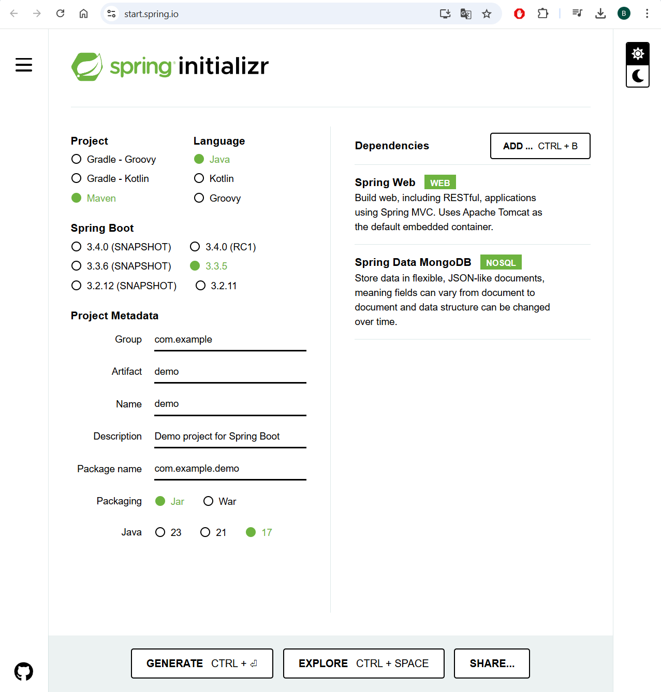

# Лабораторная работа 3
## Тема: Работа с Apache Cassandra

**Цель:** Изучение колоночной СУБД Apache Cassandra и получение практических навыков по работе с ней.

### 1. Основны Cassandra

В Cassandra вместо баз данные есть понятие пространства ключей (keyspace). В пространстве ключей могут находиться несколько колоночных семейств (column family), что является аналогом реляционной таблицы. Колоночное семейство содержит колонки (column), которые объединяются при помощи ключа (row key) и записи (value). Колонки в пределах записи упорядочены.

С каждым значением связана метка времени — задаваемое пользователем число, которое используется для разрешения конфликтов во время записи: чем больше число, тем колонка считается новее, а при сравнении перетирает старые колонки.



В Cassandra в качестве языка запросов используется CQL. Его синтаксис во многом похож на SQL, но есть некоторые особенности.


### 2. Создание хранилища ключей

Для создания нового хранилища ключей можно ввести следующую команду:
```sql
CREATE KEYSPACE university 
WITH REPLICATION = { 
    'class' : 'NetworkTopologyStrategy', 
    'datacenter1' : 1 
};
```

Посмотреть доступные пространства имён можно командой:
```sql
DESCRIBE KEYSPACES;
```

Чтобы создавать таблицы и выполнять запросы в текущем пространстве ключей нужно ввести запрос:
```sql
USE university;
```


### 3. Создание колоночных семейств

Создание нового колоночного семейства происходит аналогично созданию таблицы в реляционной СУБД:
```sql
CREATE TABLE university.student ( 
    id UUID PRIMARY KEY, 
    last_name TEXT, 
    first_name TEXT,
    paternal_name TEXT,
    date_of_birth DATE
);
```

Посмотреть доступные таблицы можно командой:
```sql
DESCRIBE TABLES;
```

Вот некоторые типы данных, которые можно использовать для создания колонок. Обращаю внимание на то, что не нужно указывать размерность у строк.
- `BOOLEAN` - булевский тип данных, имеет значения true и false;
- `DATE` - тип для хранения даты;
- `TIME` - тип для хранения времени;
- `TIMESTAMP` - тип для хранения даты и времени в одном поле;
- `FLOAT`, `DOUBLE` - типы для хранения вещественных чисел;
- `INT`, `BIGINT`, `SMALLINT` - типы для хранения целых чисел;
- `TEXT`, `VARCHAR` - типы для хранения текстовой информации;
- `UUID` - тип для хранения значений уникальных идентификаторов.

Кроме простых типов данных в Cassandra можно хранить и коллекции:
- `MAP<K,V>` - структура данных типа ключ-значение;
```sql
CREATE TABLE users (
   id text PRIMARY KEY,
   name text,
   favs map<text, text> // A map of text keys, and text values
);

INSERT INTO users (id, name, favs)
VALUES ('jsmith', 'John Smith', { 'fruit' : 'Apple', 'band' : 'Beatles' });

// Replace the existing map entirely.
UPDATE users SET favs = { 'fruit' : 'Banana' } WHERE id = 'jsmith';
```

- `SET<V>` - коллекция уникальных значений;
```sql
CREATE TABLE images (
   name text PRIMARY KEY,
   owner text,
   tags set<text> // A set of text values
);

INSERT INTO images (name, owner, tags)
VALUES ('cat.jpg', 'jsmith', { 'pet', 'cute' });

// Replace the existing set entirely
UPDATE images SET tags = { 'kitten', 'cat', 'lol' } WHERE name = 'cat.jpg';
```

- `LIST<V>` - коллекция неуникальных значений (список);
```sql
CREATE TABLE plays (
    id text PRIMARY KEY,
    game text,
    players int,
    scores list<int> // A list of integers
)

INSERT INTO plays (id, game, players, scores)
VALUES ('123-afde', 'quake', 3, [17, 4, 2]);

// Replace the existing list entirely
UPDATE plays SET scores = [ 3, 9, 4] WHERE id = '123-afde';
```

В Cassandra есть 3 типа первичноко ключа:
- Простой первичный ключ (аналогично, как в SQL);
```sql
CREATE TABLE university.student ( 
    id INT PRIMARY KEY, 
    last_name TEXT, 
    first_name TEXT,
    paternal_name TEXT,
    date_of_birth DATE
);
```

- Составной первичный ключ. Его можно использовать для хранения данных в упорядоченном виде. В приведённом примере первая запись в скобках `category` является ключом раздела (partition key). Он определяет, где хранить данные (на каком узле кластера). Вторая запись `points` определяет, по какому полю будут сортироваться данные (clustering key). Можно добавлять и другие столбцы, по которым нужна сортировка. Если порядок сортировки нужно установить обратный, нужно указать это в строчке `WITH CLUSTERING ORDER BY (points DESС)`;
```sql
CREATE TABLE cycling.cyclist_category (
   category text, 
   points int, 
   id UUID, 
   lastname text, 
   PRIMARY KEY (category, points))
WITH CLUSTERING ORDER BY (points DESС);
```

- Составной ключ раздела. Его можно использовать для того, чтобы разбить область хранения данных на более мелкие области.
```sql
CREATE TABLE cycling.cyclist_category (
   country text,
   category text, 
   points int, 
   id UUID, 
   lastname text, 
   PRIMARY KEY ((country, category), points));
```

Внешних ключей в Cassandra не существует!!!


### 4. Операции над столбцами

Добавление столбца в существующую таблицу:
```sql
ALTER TABLE university.student
ADD studak_num text;
```

Изменение типа данных столбца в таблице:
```sql
ALTER TABLE university.student
ALTER studak_num TYPE text;
```

Удаление столбца в таблице:
```sql
ALTER TABLE university.student
DROP studak_num;
```

Очистка всей таблицы:
```sql
TRUNCATE university.student;
```


### 5. Операции над индексами

Сздание нового индекса:
```sql
CREATE INDEX student_name_idx on students(first_name);
```

Удаление индекса
```sql
DROP INDEX IF EXISTS student_name_idx;
```


### 6. Запросы

Добавление записи в таблицу:
```sql
INSERT INTO students(id, last_name, first_name, paternal_name, date_of_birth)
VALUES (1, 'Иванов', 'Иван', 'Иванович', '2000-01-01');
```

Получение данных:
```sql
SELECT * FROM students WHERE name = 'Иван' LIMIT 3;
```

Обновление данных:
```sql
UPDATE students SET paternal_name = 'Петрович' WHERE id = 1;
```

Удаление данных:
```sql
DELETE FROM student WHERE name = 'Иван';
```

Сортировка данных. В `WHERE` необходимо указать ключ раздела, в `ORDER BY` - ключ класторизации. В примере указываются все записи, отсортированные по дате рождения из раздела с Иванами.
```sql
SELECT * FROM students WHERE name = 'Иван' ORDER BY date_of_birth ASK;
```

Группировка данных. Для группировки необходим первичный ключ или составной первичный ключ.
```sql
SELECT COUNT(id) FROM students GROUP BY 'Иван';
```
Если первичный ключ (p1, p2, c1, c2), то следующие запросы для него будут верными:
```sql
GROUP BY p1
GROUP BY p1, p2
GROUP BY p1, p2, c1
GROUP BY p1, p2, c1, c2
```


### Индивидуальное задание

Часть 1
- Создать папку, в которой будет docker-compose.yml файл для запуска Cassandra;
- В этой же папке создать папку data, в которой будет храниться датасет для импорта;
- В папку data поместить файл results.csv, который можно взять из репозитория по ссылке: https://github.com/martj42/international_results
- Запустить контейнер с Cassandra и войти в cqlsh;

Часть 2
- Создать хранилище ключей university;
- Создать таблицу student со следующими полями:
    - id - уникальный идентификатор;
    - fio - ФИО студента;
    - date_of_birth - дата рожение;
    - studak_num - номер студенческого билета;
    - results - оценки по каждому из предметов;
    - conferences - список конференций, в которых участвовал студент.
- Добавить в таблицу столбец study_year - год обучения;
- Заполнить таблицу записями о 5 студентах. В списке предметов должно быть от 2х до 3х предметов (не должно быть везде только 2 предмета). В списке конференций должно быть от 0 до 2х конференций (как минимум 3 человека должны посетить конференции).
- Сделать запросы на получение данных:
    - Выбрать всех студентов старше 20;
    - Выбрать студентов, которые посещали хотя бы одну конференцию;
    - Выбрать студентов, которые посещали конференцию с названием "..."
    - Выбрать студентов, у которых оценка по предмету "..." равна 5.

Часть 3
- Создать таблицу с данными с колонками results.csv. ПОДУМАТЬ, КАКИМИ БУДУТ partition key и clustering key!!!
    - date - дата матча;
    - home_team - имя первой команды;
    - away_team - имя второй команды;
    - home_score - результат первой команды;
    - away_score - результат второй команды;
    - tournament - название турнира;
    - city - город проведения матча;
    - country - страна проведения матча;
    - neutral - true/false значение, если матч был проведён на нейтральной территории;
- Создать индексы для колонок home_team, away_team, home_score, away_score, tournament;
- Сделать запросы получение данных:
    - Посчитать количество записей;
    - Вывести 5 матчей, которые были сырганы командой России;
    - Вывести матчи, где играла Бразилия против Аргентины на событиии FIFA World Cup;
    - Подсчитать среднее количество очков, которое получала Италия на событиии FIFA World Cup в качестве первого игрока;
    - Вывести последние 3 матрча, проведённые в Китае;
    - Вывести список стран с количеством проведённых в них чемпионатов FIFA World Cup qualification;


### Содержание отчёта

1. Титульный лист
2. Цель работы
3. Поэтапная демонстрация запросов и выводимых результатов
6. Вывод


### Дополнительные материалы

Файл для запуска Cassandra:
```yml
version: "3.7"

services:
  cassandra:
    image: cassandra:latest
    container_name: cassandra
    networks:
      - cassandra
    ports:
      - "9042:9042"
    volumes:
      - ./data/results.csv:/opt/data/results.csv
```

Пример импорта данных из CSV:
```sql
COPY consumer_complaints (Date_received,Product,Sub_product, Company_public_response, Company) FROM 'c.csv' WITH HEADER = true;
```

