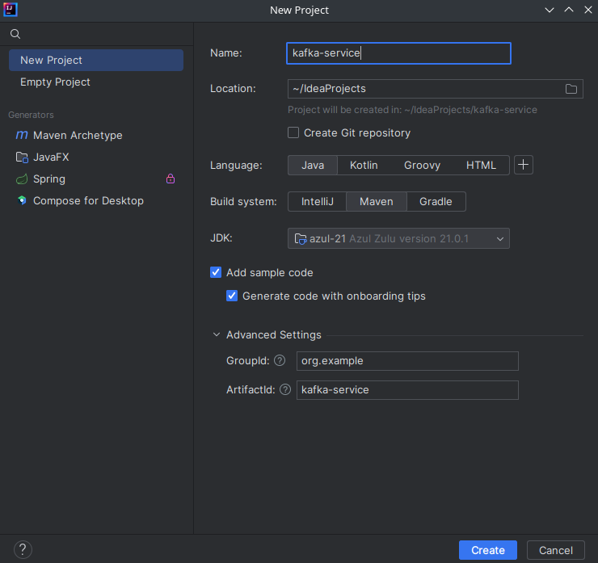

# Лабораторная работа 5
## Тема: Работа с брокером сообщения Kafka

**Цель:** С помощью языка программирования Java и фреймворка Spring Boot создать два веб-сервиса, которые обмениваются между собой сообщениями через Kafka.

### 1. Создание Maven-проекта
Первым делом необходимо создать новый Maven-проект, задать ему название и выбрать для него версию JDK.


### 2. Заполнение главного xml-файла
В файле `pom.xml` необходимо поделючить библиотеки для всех модулей проекта. Такими библиотеками будут являться библиотеки спринга и библиотека кафки. Добавим в файл внутрь элемента `<project>` следующие строчки.

Для наследования проекта от спринг-проекта:
```xml
<parent>
    <groupId>org.springframework.boot</groupId>
    <artifactId>spring-boot-starter-parent</artifactId>
    <version>3.1.7</version>
</parent>
```

Для подключения библиотек:
```xml
<dependencies>
    <!-- Spring Web для приёма web-запросов -->
    <dependency>
        <groupId>org.springframework.boot</groupId>
        <artifactId>spring-boot-starter-web</artifactId>
    </dependency>
    <!-- Spring Kafka для подключения к Kafka -->
    <dependency>
        <groupId>org.springframework.kafka</groupId>
        <artifactId>spring-kafka</artifactId>
    </dependency>
    <!-- Lombok для упрощения создания классов -->
    <dependency>
        <groupId>org.projectlombok</groupId>
        <artifactId>lombok</artifactId>
        <optional>true</optional>
    </dependency>
</dependencies>
```

Для сборки приложения в JAR-файл:
```xml
<build>
    <plugins>
        <plugin>
            <groupId>org.springframework.boot</groupId>
            <artifactId>spring-boot-maven-plugin</artifactId>
            <configuration>
                <excludes>
                    <exclude>
                        <groupId>org.projectlombok</groupId>
                        <artifactId>lombok</artifactId>
                    </exclude>
                </excludes>
            </configuration>
        </plugin>
    </plugins>
</build>
```

После этого необходимо удалить папку `src` из проекта со всем его содержимим.

### 3. Создаём модуль kafka-producer

Правой кнопкой по главному проекту и выбираем пункт меню, который показан на рисунке.


Вводим название модуля - `kafka-producer`. В качестве Parent выбираем `kafka-serice`. Нажимаем создать модель.

Модуль будет принимать объект в веб-запросе и передавать, ставить у него время приёма и передавать его в kafka.

У каждого модуля есть свой файл `pom.xml`, где можно подключать зависимости, специфичные для конкретного модуля. В данном случае никаких дополнительных зависимостей нам подключать не нужно.

### 4. Создаём классы модуля kafka-producer

Класс `Main`, который был автоматически сгенерирован при создании модуля удалим и созданим новый класс `ProducerApp`, где инициализируем и запустим наше Spring-приложение:
```java
@SpringBootApplication
public class ProducerApp {
    public static void main(String[] args) {
        SpringApplication.run(ProducerApp.class, args);
    }
}
```

Далее создадим структуру пакетов нашего проекта в `kafka-service/kafka-producer/src/main/java/org/example`. В неё будут входить пакеты: `config`, `controller`, `model`, `producer`, `service`.

В папке `resourses` создадим файл application.properties. Заполним его следующим содержимым:
```properties
# Порт на котором будет запускаться сервер
server.port=8080
# Название топика в kafka
topic.name=topic.books
```

В пакете `config` создадим класс `KafkaConfig`. Помечаем его аннотацией `@Configuration`. В нём получаем `TOPIC_NAME` из файла application.properties, создаём бины для инициализации подключения к kafka и создаём новый топик с именем в `TOPIC_NAME`.
```java
@Configuration
public class KafkaConfig {
    @Value("${topic.name}")
    private String TOPIC_NAME;
    @Autowired
    private KafkaProperties kafkaProperties;

    @Bean
    public ProducerFactory<String, String> producerFactory() {
        Map<String, Object> properties = kafkaProperties.buildProducerProperties();
        return new DefaultKafkaProducerFactory<>(properties);
    }

    @Bean
    public KafkaTemplate<String, String> kafkaTemplate() {
        return new KafkaTemplate<>(producerFactory());
    }

    @Bean
    public NewTopic topic() {
        return TopicBuilder
                .name(TOPIC_NAME)
                .partitions(1)
                .replicas(1)
                .build();
    }
}
```

В пакете `model` создаём класс нашего объекта, который будем принимать от пользователя и передавать в kafka. Аннотации библиотеки lombok `@NoArgsConstructor` и `@AllArgsConstructor` создадут для класса конструкторы по умолчанию и со всеми параметрами. Аннотация `@Data` сгенерирует гетеры, сеттеры, методы toString, equals и hashCode.
```java
@NoArgsConstructor
@AllArgsConstructor
@Data
public class Book {
    private Integer id;
    private String title;
    private String author;
    private LocalDateTime receivedDate;
}
```

В пакете `controller` создадим класс `BookController` и пометим его аннотацией `@RestController`. Здесь будет принимать пост-запрос с JSON-объектом в теле запроса и передавать его в `BookService` на обработку.
```java
@RestController
public class BookController {
    @Autowired
    private BookService bookService;
    
    @GetMapping
    public String getRequest() {
        return "All works!";
    }
    
    @PostMapping
    public String postRequest(@RequestBody Book book) {
        return bookService.processBook(book);
    }
}
```

В пакете `service` создадим класс `BookService` и пометим его аннотацией `@Service`. Аннотация `@Slf4j` библиотеки lombok даст возможность использовать логирование в классе через переменную `log`. В этом классе мы выставляем дату приёма сообщения от клиента, выводим в логи сообщение, что приняли объект и передаём сообщение на отправку в producer.
```java
@Slf4j
@Service
public class BookService {
    @Autowired
    private BookProducer bookProducer;
    
    public String processBook(Book book) {
        book.setReceivedDate(LocalDateTime.now());
        log.info("Books is received by kafka-producer: {}", book);
        return bookProducer.send(book);
    }
}
```

В пакете `producer` создадим класс `BookProducer`. Пометим его аннотацией `@Component`. В этом классе получаем название топика из конфига. Внедряем зависимости для `KafkaTemplate`, который отправит нам сообщение в kafka и `ObjectMapper`, который сконвертирует объектв в JSON-формат. В методе `send` просто конвертируем объект и отправляем его. После чего выводим сообщение в логи, что всё обработано и возвращаем строку с положительным результатом.
```java
@Slf4j
@Component
public class BookProducer {
    @Value("${topic.name}")
    private String orderTopic;

    @Autowired
    private ObjectMapper objectMapper;
    @Autowired
    private KafkaTemplate<String, String> kafkaTemplate;

    public String send(Book book) {
        try {
            String message = objectMapper.writeValueAsString(book);
            kafkaTemplate.send(orderTopic, message);

            log.info("Book produced {}", message);

            return "Message sent";
        } catch (JsonProcessingException e) {
            return "Error parse json";
        }
    }
}
```

На этом написание модуля `kafka-producer` окончено. Можно запустить приложение и посмотреть, что никаких ошибок нет и всё работает.

### 5. Создаём модуль kafka-consumer

Аналогично предыдущему модулю нажимаем правой кнопкой на проекте `kafka-service` и добавляем в него новый модуль с названием `kafka-consumer`.

Модуль будет читать сообщение из топика в kafka и выводить его в консоль.


### 6. Создаём классы модуля kafka-consumer

Класс `Main`, который был автоматически сгенерирован при создании модуля удалим и созданим новый класс `ConsumerApp`, где инициализируем и запустим наше Spring-приложение:
```java
@SpringBootApplication
public class ConsumerApp {
    public static void main(String[] args) {
        SpringApplication.run(ConsumerApp.class, args);
    }
}
```

Далее создадим структуру пакетов нашего проекта в `kafka-service/kafka-consumer/src/main/java/org/example`. В неё будут входить пакеты: `model`, `consumer`.

В папке `resourses` создадим файл application.properties. Заполним его следующим содержимым:
```properties
# Порт на котором будет запускаться сервер
server.port=8081
# Название топика в kafka
topic.name=topic.books
spring.kafka.consumer.group-id=default
```

В пакет `model` можно скопировать класс из пакета `model` модуля `kafka-producer`.

В пакете `consumer` создадим класс `BookConsumer`. Пометим его аннотацией `@Component`. Внедрим для него зависимость от `ObjectMapper` для конвертации из JSON-строки в java-объект. Метод `consumeMessage` помечен аннотацией `@KafkaListener`, которая передаёт в метод очередную строку из топика kafka. Полученный сконвертированный объект выводим в консоль.
```java
@Slf4j
@Component
public class BookConsumer {
    @Autowired
    private ObjectMapper objectMapper;

    @KafkaListener(topics = "${topic.name}")
    public void consumeMessage(String message) throws JsonProcessingException {
        Book book = objectMapper.readValue(message, Book.class);
        log.info("Book consumed: {}", book);
    }
}
```

### 7. Запуск сервера с kafka через docker-compose

В корне проекта создадим файл docker-compose.yml и вставим в него следующий текст:
```yml
version: "3.7"

services:
  zookeeper:
    image: zookeeper:3.7.0
    container_name: zookeeper
    restart: always
    networks:
      - kafka-net
    ports:
      - "2181:2181"

  kafka:
    image: obsidiandynamics/kafka
    container_name: kafka
    restart: always
    networks:
      - kafka-net
    ports:
      - "9092:9092"
    environment:
      KAFKA_LISTENER_SECURITY_PROTOCOL_MAP: DOCKER_INTERNAL:PLAINTEXT,DOCKER_EXTERNAL:PLAINTEXT
      KAFKA_LISTENERS: DOCKER_INTERNAL://:29092,DOCKER_EXTERNAL://:9092
      KAFKA_ADVERTISED_LISTENERS: DOCKER_INTERNAL://kafka:29092,DOCKER_EXTERNAL://${DOCKER_HOST_IP:-127.0.0.1}:9092
      KAFKA_INTER_BROKER_LISTENER_NAME: DOCKER_INTERNAL
      KAFKA_ZOOKEEPER_CONNECT: "zookeeper:2181"
      KAFKA_BROKER_ID: 1
      KAFKA_OFFSETS_TOPIC_REPLICATION_FACTOR: 1
    depends_on:
      - zookeeper

  kafdrop:
    image: obsidiandynamics/kafdrop
    container_name: kafdrop
    restart: always
    networks:
      - kafka-net
    ports:
      - "9000:9000"
    environment:
      KAFKA_BROKERCONNECT: "kafka:29092"
    depends_on:
      - "kafka"

networks:
  kafka-net:
    name: kafka-net
    driver: bridge
```

Переходим в консоль и заходим в папке проекта. Пишем команду `docker compose up -d`. Docker предварительно должен быть установлен. Для остановки можно ввести команду `docker compose down`.

- Kafka поднимется на порту 9092
- Kafdrop поднимется на порту 3000

После этого можно запустить модули
- `kafka-producer`
- `kafka-consumer`

И проверить их работоспособность:




### Индивидуальное задание

В работе описан простейший пример двух веб-сервисов, обменивающихся сообщениями при помощи Kafka. По этому примеру необходимо сделать программу со следующей логикой:


Алгоритм работы веб-сервисов должен заключаться в следующем:
1. Пользователь отправляет на Веб-сервер 1 REST-запрос на создание файла.
2. Веб-сервер 1 проводит необходимые проверки входящего запроса, запрашивает объект из базы, по которому нужно сделать отчёт и отправляет данные об этом объекте в формате JSON в топик `topic-request`. Пользователю возвращается статус 201 с текстом "Запрос зарегистрирован".
3. Веб-сервер 2 читает данные из топика `topic-request` и на их основе создаёт файл по варианту (список вариантов представлен ниже) с содержимым переданного объекта.
4. Файл сохраняется на диск в какую-то папку (придумать самостоятельно, в какую).
5. В `topic-response` передаётся id объекта, по которому сформирован файл.
6. Веб-сервер 1 читает данные из топика `topic-response` и выставляет флаг о готовности файла `fileCreated` в объект по его id.

Алгоритм выполнения работы:
- Добавить в вашу предметную область новый аттрибут `fileCreated` типа boolean со значением по умолчанию `false`. 
- Создать проект и добавить в него два модуля. Каждый из модулей будет отвечать за свой веб-сервис.
- Написать код для модуля Веб-сервиса 1.
- Запустить docker-compose.yml файл с кафкой.
- С помощью Kafdrop проверить, что публикация сообщений в Kafka в топик `topic-request` работает.
- Написать код для модуля Веб-сервиса 2.
- Проверить, что работает чтение из топика `topic-request`.
- Проверить, что работает создание файла и сохранение его на диск.
- Проверить, что работают чтение и запись в топик `topic-response`.
- В отчёт прикрепить работу программы целиком.


### Варианты индивидуального задания:
1. В файл csv;
2. В файл txt в формате вертикальной таблицы;
3. В файл html в формате таблицы;
4. В файл pdf;
5. В файл xlsx;
6. В файл xml;
7. В файл docx;
8. В файл jpeg.


### Содержание отчёта

1. Титульный лист
2. Цель работы
3. Код программы (в заголовке название файла)
4. Скрины демонстрации работы программы (отправка сообщения в kafka-producer; лог, что сообщение принято; наличие сообщения в kafdrop; лог приёма сообщения kafka-consumer; файл с сохранённым сообщением)
5. Пояснения по поводу процесса обработки сообщения (что откуда куда передаётся и где сохраняется)
6. Вывод
