# Лабораторная работа 6
## Тема: Мониторинг приложения при помощи Prometheus и Grafana

**Цель:** Ознакомиться с базой данных временных рядов Prometheus. Настроить мониторинг Spring Boot приложения. Визуализировать данные мониторинга при помощи дашбордов в Grafana.

### 1. Что такое мониторинг

Мониторинг приложения — это процесс сбора, измерения, анализа и визуализации данных о работе приложений и их компонентов с целью обеспечения их надёжности, производительности и эффективности.

Мониторинг позволяет в режиме реального времени следить за состоянием и поведением приложений, а также выявлять и устранять проблемы и узкие места, которые могут влиять на работу приложения.


### 2. Введение в Prometheus

Prometheus — бесплатная система мониторинга серверов и программ с открытым исходным кодом. Она может собирать информацию о состоянии серверов и систем (Linux-сервера, Apache-сервера, сервера баз данных), а также получать предупреждения о проблемах.

Prometheus получает метрики при помощи HTTP-вызовов к определённым эндпоинтам приложения, которые указаны в конфигурации Prometheus. Такой способ получения метрик называется скрейпингом.

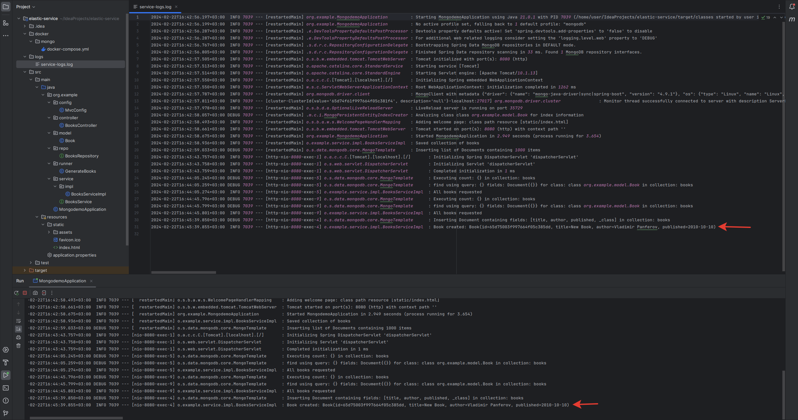

Prometheus может извлекать метрики следующими способами:
- При помощи библиотеки Prometheus внутри приложения. Эта библиотека добавит в приложение эндпоинт, по которому будут предоставляться метрики о работе приложения.
- Использование готовых экспортеров. Экспортер - это уже готовое приложение, которое предназначено для сбора характеристик определённой системы. Например, у Prometheus есть готовые экспортеры для мониторинга машин Linux (Node Exporter), для распространенных баз данных (SQL Exporter или MongoDB Exporter) и даже для балансировщиков нагрузки HTTP (например, HAProxy Exporter).
- Использование Pushgateway. Это сервис, который позволяет недолговечным заданиям отправлять свои метрики в Prometheus. Он подходит для приложений, которые не могут самостоятельно предоставлять метрики для Prometheus. В этом случае приложение само отдаёт свои метрики и кладёт их в кэш Pushgateway, после чего Prometheus их скрейпит.

Отличием Prometheus от других систем мониторинга является то, что он сам активно сканирует целевые объекты для сбора метрик. В таком случае настройка по сборам метрик выполняется централизованно внутри Prometheus, а не на стороне сканируемых объектов системы.

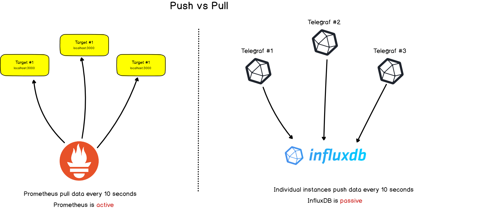


### 3. Концепции Prometheus

Метрики в Prometheus описываются парой ключ-значение. Ключ описывает то, что мы измеряем. А значение - фактическую числовую величину той или иной метрики. Кроме этого, у метрики есть тип и текстовое описание. Пример метрики:
```
cpu_usage 20.05
```
Иногда одного лишь ключа для описания метрики не достаточно. Поэтому, у Prometheus есть дополнительные метаданные, которые описывают метрику. Их называют ярлыками или тэгами. С помощью них можно конкретизировать метрику:
```
cpu_usage{core="1"} 20.05
http_requests_total{method="POST", url="/messages"} 1
http_requests_total{method="GET", url="/messages"} 3
http_requests_total{method="POST", url="/login"} 2
```

- HELP - описание метрики;
- TYPE - тип метрики;
- cpu_usage - название метрики;
- набор key-value лейблов (можно еще называть их тегами);
- значение метрики (имеет тип double)
- после сбора метрики в БД добавляется ещё timestamp.


### 4. Типы метрик Prometheus

Всего в Prometheus существует 4 типа метрик: Counter, Gauge, Histogram, Summary.

**Counter (Счётчик)**

Counter - является самой простой метрикой. Это монотонно возрастающее число. Никогда не убывает!!! Может быть сброшен в 0 (например, при рестарте сервиса). Можно использовать, например, для подсчёта количества посещений сайта, количества обработанных запросов и т.д.

```
http_requests_total{url="/login"} 10
http_requests_total{url="/"} 100
```

**Gauge (Измеритель)**

Gauge - число, которое может увеличиваться и уменьшаться. Для простоты понимания - этот тип метрик работает как стрелка на спидометре. Хорошо подходит для измерения текущего значения метрики. Можно использовать, например, для измерения количества активных сессий, использования ресурсов сервера (cpu, memory, disk) и т.д.

```
http_active_requests{app="web"} 5
disk_free_bytes{path="/tmp/"} 37359484928
```

**Histogram (Гистограмма)**

Histogram — это более сложный тип метрики. Она предоставляет дополнительную информацию. Например, сумму измерений и их количество. Гистограмма - это агрегация чего-то самим приложением, когда нам интересно знать распределение величин по заранее определенным группам (buckets).

Например, мы хотим знать длительность HTTP-запросов. Определимся, какое время считать хорошим, какое плохим, и насколько детально мы хотим это знать. Можно сказать, качественное распределение:

- `<= 0.1` сек. — хороший запрос, ожидаем, что таких будет большинство;

- `<= 1` — сойдет, но лучше бы знать, что такие встречаются;

- `<= 5` — подозрительно, пойдем смотреть код, если таких окажется много;

- `больше 5` — вообще плохо, для однообразия можно сказать, что это <= infinity.

Как это работает: пришел запрос, померяли время обработки X и обновили гистограмму: добавили +1 в соответствующие группы и добавили +X к суммарному времени. Вот несколько примеров попадания запросов с разным временем в бакеты:

- `0.01` попадет во все бакеты: `<= 0.1`, `<= 1`, `<= 5`, `<= infinity`;

- `0.3` попадет в бакеты кроме первого: `<= 1`, `<= 5`, `<= infinity`. В первый не попадает, т.к. время больше `0.1`;

- `4` попадет в бакеты: `<= 5`, `<= infinity`. В первый и второй не попадает, т.к. время больше `0.1` и `1`;

- `10` попадет только в бакет `<= infinity`. В остальные не попадает, т.к. время больше `0.1`, `1` и `5`.

```
http_duration_bucket{url="/", le="0.1"} 100
http_duration_bucket{url="/", le="1"} 130
http_duration_bucket{url="/", le="5"} 140
http_duration_bucket{url="/", le="+Inf"} 141

http_duration_sum{url="/"} 152.7625769
http_duration_count{url="/"} 141
```

Тэг 'le' означает "less than or equal".

Бонусом гистограмма считает сумму (_sum) и количество (_count) записанных значений.

Гистограмма считает количество попаданий в какую-то группу, то есть запоминает счетчики, а не сами значения! Мы ведь ограничены тем, что метрика сама по себе — это только одно число. Каждый бакет — как бы отдельная метрика.

Гистограммы применяются для характеристик, в которых нужно знать пропорции измеряемых величин.

**Summary (Сводка)**

Summary — это результат агрегации гистограммы. Она выдает сразу квантили, можно сказать, количественное распределение, когда мы заранее не можем определить бакеты.

Квантили — это деление плотности вероятности на отрезки равной вероятности.

Проще всего объяснить на практике: обычно мы заранее не знаем, что считать хорошим временем для запроса, а что плохим. Поэтому просто закинем измеренное время в Summary, и потом посмотрим, во что впишутся 95% запросов. Ну и 50%, и 99% тоже. Итак, пришел запрос, померяли время обработки X, записали в Summary:

- +1 в счетчик количества запросов;

- само время X закинули во множество значений в памяти приложения;

- пересчитали квантили;

- периодически придется выкидывать из памяти старые значения, чтобы не расходовать ее бесконечно.

```
http_duration_summary{quantile="1"} 100
http_duration_summary{quantile="0.99"} 4.300226799
http_duration_summary{quantile="0.95"} 2.204090024
http_duration_summary{quantile="0.5"} 0.073790038
http_duration_summary{quantile="0.1"} 0.018127115

http_duration_summary_sum 152.7625769
http_duration_summary_count 141
```

Как это интерпретировать? Здесь тоже что-то вроде бакетов, как в гистограмме, но с другим смыслом. Если вкратце, метрика с quantile="0.95" говорит нам, что 95% запросов выполнялись быстрее, чем за 2.2 секунды. Аналогично, 99% запросов выполнялись быстрее, чем 4.3 секунды, и так далее. Как это работает и зачем нужно, станет понятно только после объяснения квантилей, поэтому вернемся к Summary в последней части.


### 5. Подключение Spring Boot приложения к Prometheus

Чтобы добавить поддержку сбора метрик при помощи Prometheus в Spring Boot приложение, необходимо добавить в `pom.xml` следующие зависимости:
```xml
<dependency>
    <groupId>org.springframework.boot</groupId>
    <artifactId>spring-boot-starter-web</artifactId>
</dependency>
<dependency>
    <groupId>org.springframework.boot</groupId>
    <artifactId>spring-boot-starter-actuator</artifactId>
</dependency>
<dependency>
    <groupId>io.micrometer</groupId>
    <artifactId>micrometer-registry-prometheus</artifactId>
    <scope>runtime</scope>
</dependency>
```

Для активации эндпоинта приложения с метриками в файл `application.properties` необходимо добавить следующие настройки:
```conf
management.endpoints.web.exposure.include=health,prometheus
management.metrics.export.prometheus.enabled=true
```

После добавления этих зависимостей можно запустить приложение. Библиотека `spring-boot-starter-actuator` добавит в приложение эндпоинт `/actuator` по которому будут отображены все доступные эндпоинты для мониторинга приложения.

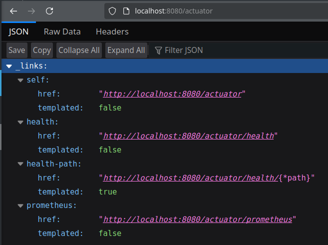

Например, перейдя по эндпоинту `/actuator/health` мы получим статус нашего приложения - работает оно или упало.

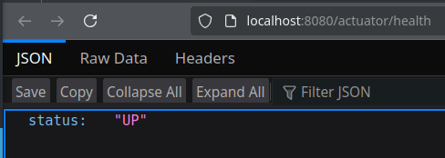

Библиотека `micrometer-registry-prometheus` добавляет в актуатор ещё один эндпоинт - `/actuator/prometheus`, по которому располагаются метрики для Prometheus. Обращаясь именно по этому адресу, Prometheus будет забирать метрики. Эта страница уже содержит набор стандартных метрик для Spring приложения.

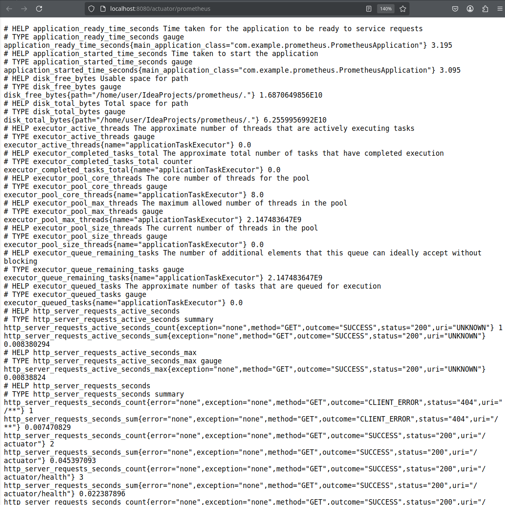


### 6. Добавление собственных метрик в Spring Boot приложение

Помимо стандартных метрик можно добавлять и свои метрики внутри Spring приложения. Для этого есть несколько способов. Воспользуемся одними из них - добавление метрик при помощи библиотечных аннотаций. Для этого способа нам нужно создать конфигурационный класс и инициализировать в нём бины с аспектами тех типов метрик, которые нам нужны.
```java
@Configuration
@EnableAspectJAutoProxy(proxyTargetClass = true)
public class AppConfiguration {
    @Bean
    public CountedAspect countedAspect(MeterRegistry registry) {
        return new CountedAspect(registry);
    }

    @Bean
    public TimedAspect timedAspect(MeterRegistry registry) {
        return new TimedAspect(registry);
    }
}
```

В данном случае мы инициализировали бины:
- `CountedAspect` - он позволит нам использовать аннотацию `@Counted`.
- `TimedAspect` - он позволит нам использовать аннотацию `@Timed`.

Над конфигурационным классом нужно не забыть добавить аннотацию `@EnableAspectJAutoProxy(proxyTargetClass = true)`.

Теперь мы можем использовать эти аннотации над методом, метрики которого мы хотим измерить. В качестве примера использую сервис, в котором будет только один метод. Он будет завершаться успешно или исключением в зависимости от переданного в него параметра.
```java
@Service
public class ActionService {
    private final static Logger log = LoggerFactory.getLogger(ActionService.class);

    @Counted(value = "ACTIONS_DONE")
    @Timed(value = "ACTIONS_TIME")
    public void doAction(boolean isAction) {
        if (isAction) {
            log.info("Action done!!!");
        } else {
            log.info("Error done!!!");
            throw new RuntimeException("Done error!!!");
        }
    }
}
```

Над этим методом вешаем аннотации `@Counted` и `@Timed`. В параметре value для аннотаций указываем название метрики, которую мы измеряем. 

Аннотация `@Counted` является имплементацией метрики Counter и показывает, сколько раз был вызван этот метод.

Аннотация `@Timed` является имплементацией метрики Summary и Gauge и показывает статистику по времени выполнения метода и максимальное время выполнения метода.

Зайдём на эндпоинт `/actuator/prometheus` и посмотрим, каким будет значение данных метрик:
```
# HELP ACTIONS_DONE_total  
# TYPE ACTIONS_DONE_total counter
ACTIONS_DONE_total{class="com.example.prometheus.ActionService",exception="RuntimeException",method="doAction",result="failure"} 1.0
ACTIONS_DONE_total{class="com.example.prometheus.ActionService",exception="none",method="doAction",result="success"} 2.0
# HELP ACTIONS_TIME_seconds  
# TYPE ACTIONS_TIME_seconds summary
ACTIONS_TIME_seconds_count{class="com.example.prometheus.ActionService",exception="RuntimeException",method="doAction"} 1
ACTIONS_TIME_seconds_sum{class="com.example.prometheus.ActionService",exception="RuntimeException",method="doAction"} 0.001156351
ACTIONS_TIME_seconds_count{class="com.example.prometheus.ActionService",exception="none",method="doAction"} 2
ACTIONS_TIME_seconds_sum{class="com.example.prometheus.ActionService",exception="none",method="doAction"} 0.001841019
# HELP ACTIONS_TIME_seconds_max  
# TYPE ACTIONS_TIME_seconds_max gauge
ACTIONS_TIME_seconds_max{class="com.example.prometheus.ActionService",exception="RuntimeException",method="doAction"} 0.001156351
ACTIONS_TIME_seconds_max{class="com.example.prometheus.ActionService",exception="none",method="doAction"} 0.001536961
```

Видим, что для метрики `ACTIONS_DONE_total` было сделано два counter - один для успешно выполненного метода и один для метода, завершённого ошибкой. Статус завершения метода отображается в тэге `result`. Кроме того, в тэгах представлены другие метаданные по этому методу.

Для метрики `ACTIONS_TIME_seconds` было сделано два summary - аналогично для успешного и неудачного завершения метода.

Кроме того, была создана ещё одна метрика - `ACTIONS_TIME_seconds_max` типа gauge, которая отображает максимальное время выполнения метода для успешного и неудачного завершения метода.


### 7. Сбор метрик при помощи Prometheus

В корне проекта создадим папку `docker`. В ней создадим следующую структуру:
```
.
├── docker
│   ├── docker-compose.yaml
│   ├── grafana
│   │   └── grafana_data
│   └── prometheus
│       └── prometheus.yaml
├─...
...
```

Для linux и macos нужно убедиться, что аттрибуты доступа у папки `grafana_data` следующие: `rwxrwxrwx`!!! Иначе контейнер с grafana может не запуститься в дальнейшем.

Файл `prometheus.yaml` заполним следующим содержимым:
```yaml
scrape_configs:
  - job_name: 'sample_monitoring'               # Название задачи по сканированию
    scrape_interval: 5s                         # Интервал, с которым prometheus запрашивает метрики от сервисов
    metrics_path: '/actuator/prometheus'        # Эндпоинт, по которому запрашиваются метрики
    static_configs:
      - targets: 
        - host.docker.internal:8080             # Сервисы, с которых запрашиваются метрики
```

`host.docker.internal` - это адрес хоста докера. Так как наше Spring приложение мы запускаем из хостовой операционной системы, а не из докер-контейнера, то указываем здесь именно этот адрес.

- Для Windows и Linux: `host.docker.internal`
- Для MacOS: `docker.for.mac.localhost`

Файл `docker-compose.yaml` заполним следующим содержимым:
```yaml
version: '3.7'

services:
  prometheus:
    image: prom/prometheus
    container_name: prometheus
    ports:
      - '9090:9090'
    volumes:
      - ./prometheus/prometheus.yaml:/etc/prometheus/prometheus.yaml
    command:
      - '--config.file=/etc/prometheus/prometheus.yaml'
    # extra_hosts:
    #   - 'host.docker.internal:host-gateway'
    networks:
      - monitoring

  grafana:
    image: grafana/grafana
    container_name: grafana
    ports:
      - '3000:3000'
    volumes:
      - ./grafana/grafana_data:/var/lib/grafana:rw
    networks:
      - monitoring

networks:
  monitoring:
    driver: bridge
```

В этом файле мы запускаем два контейнера: `prometheus` и `grafana`. Если хостовая ОС - Linux, то нужно раскомментировать закомментированные строчки для правильной работы контейнеров.

Когда вся конфигурация готова - переходим в папку `docker` и выполняем команду, чтобы запустить контейнеры:
```sh
docker compose up -d
```

После этого стартуем наш сервер на порту 8080.

Теперь можем перейти по адресу `localhost:9090` и у нас откроется интерфейс Prometheus.

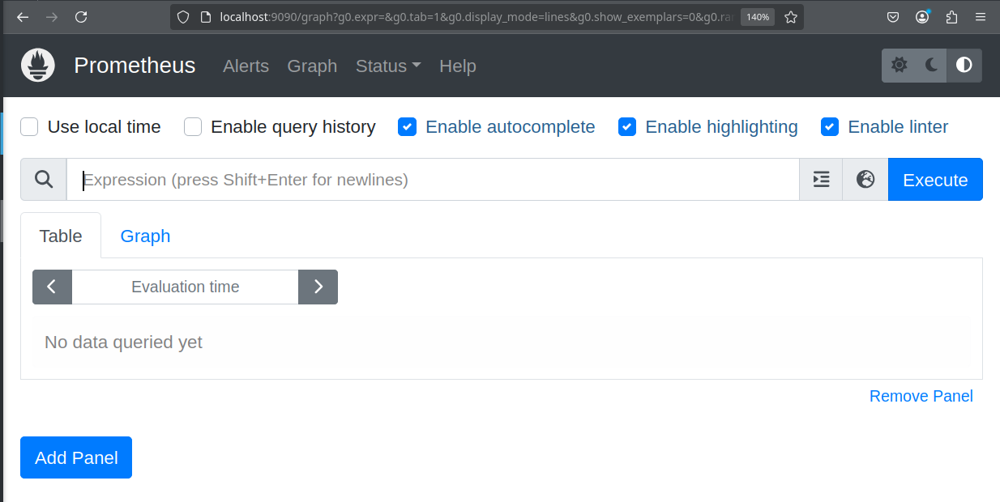

Проверим, удаётся ли прометеусу подключиться к нашему сервису и считать с него метрики. Для этого в панели меню нужно открыть выпадающий список `Status` и выбрать пункт `Targets`. Откроется страница со статусом по подключенным сервисам. Если в таблице в колонке `State` статус **UP**, то prometheus успешно подключился к нашему приложению.

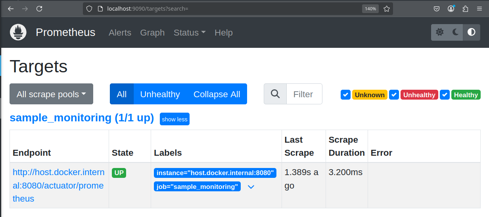

Если соединение установлено успешно, можно вернуться на вкладку `Graph` и попробовать посмотреть значение какой-то из метрик. Для этого нужно ввести название метрики в поисковую строку. В ответе появится значение этой метрики

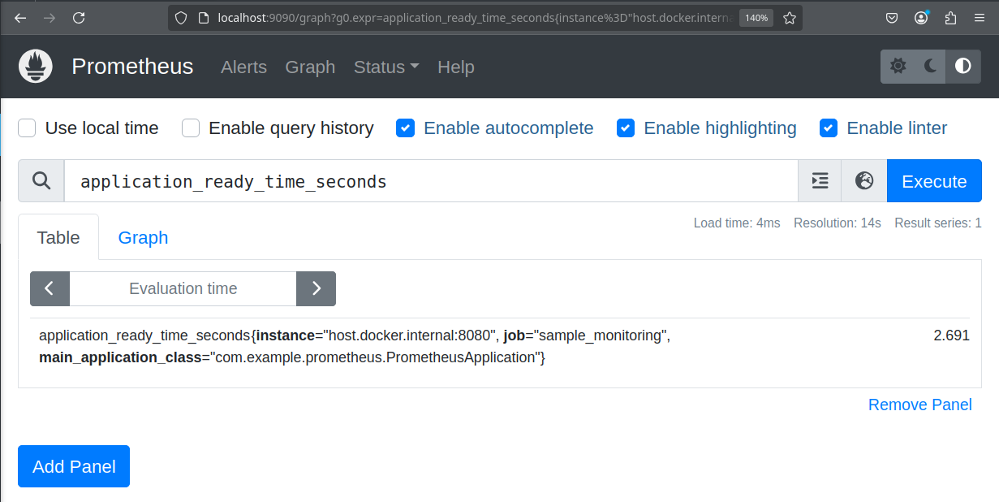

На вкладке **Graph** под поисковой строкой можно увидеть график изменения метрики. Посмотрим его на примере метрики `jvm_memory_committed_bytes`.

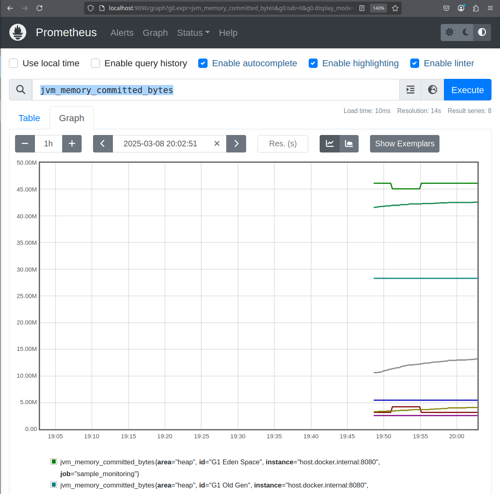

Язык запросов, на котором производится поиск в Prometheus называется PromQL. Пример такого запроса может быть следующим. Найдём все значения `jvm_memory_committed_bytes`, у которых id начинается с G1:
```
jvm_memory_committed_bytes{id=~"G1.*"}
```


### 8. Построение дашбордов в Grafana

Для наглядного представления метрик, аналитического и системного мониторинга существуют системы визуализации данных. Одной из таких является Grafana. При помощи неё можно строить дашборды и отображать на этих дашбордах метрики в наглядном виде. Откроем в браузере `localhost:3000`, на котором запущена Grafana.

При первом заходе откроется форма аутентификации. Учётной записью по-умолчанию является: логин - **admin**, пароль - **admin**. П

После входа в учётную запись будет предложено сменить пароль. Этот шаг можно пропустить, нажав кнопку **Skip**.

В итоге мы попадаем на стартовую страницу Grafana.

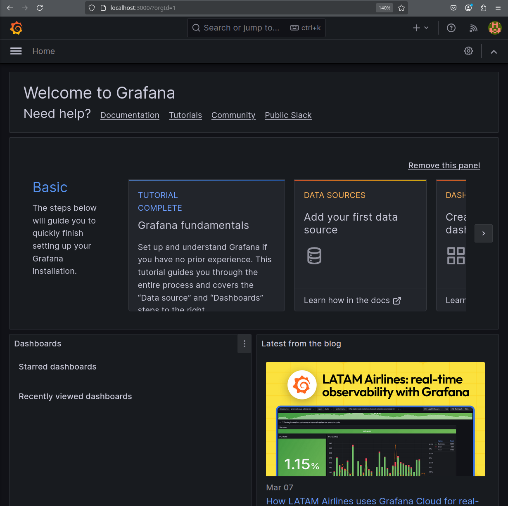

Для создания нового дашборда нужно в главном меню выбрать вкладку **Dashboards**. В этой вкладке нужно нажать кнопку **Create Dashboards**.

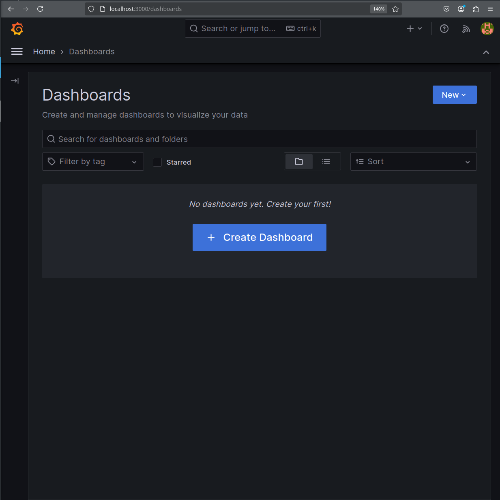

После этого нужно нажать кнопку **Add visualization**. Поскольку мы ещё не подключали Prometheus к Grafana, нужно будет нажать кнопку **Configure New Datasource**. 

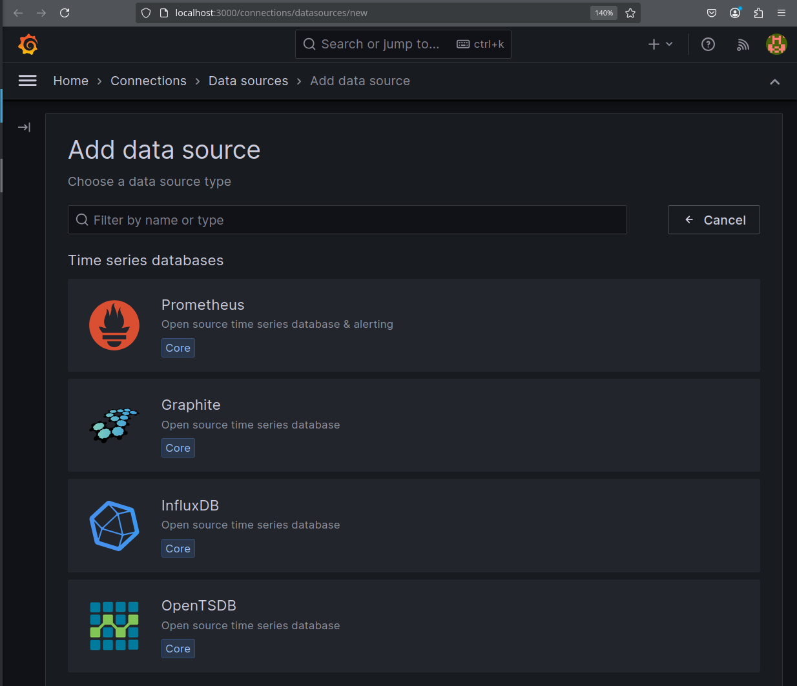

Grafana умеет работать с разными системами мониторинга и базами данных временных рядов. Здесь нам  нужно выбрать **Prometheus**. На открывшейся вкладке вводим URL-адрес Prometheus - `http://prometheus:9090`.

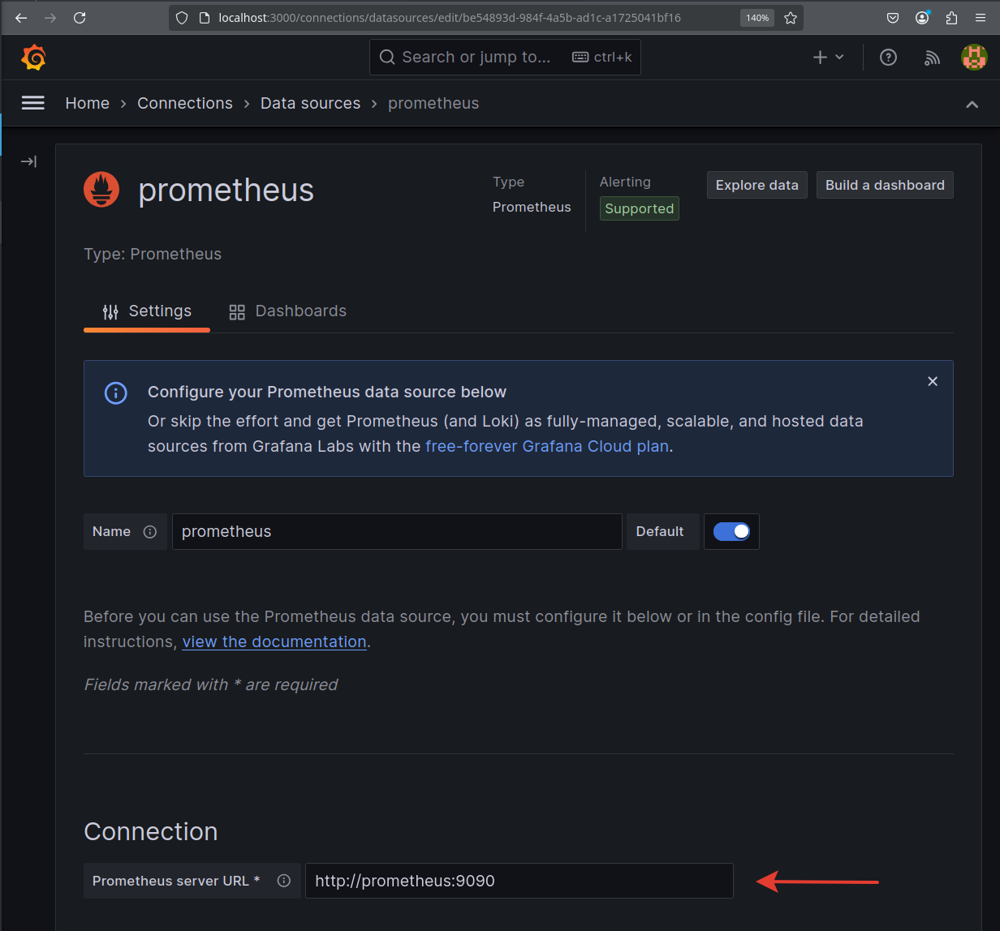

Остальные параметры оставляем по-умолчанию, переходим в нижнюю часть страницы и нажимаем **Save & test**. При успешном подключении появится следующее сообщение.

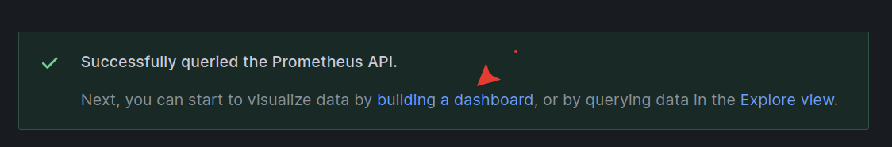

Для создания нового дашборда нужно нажать на ссылку **building a dashboard**. Затем снова нажимаем **Add visualization** и далее выбираем уже созданный источник данных - Prometheus. Откроется панель по созданию новой диаграммы.

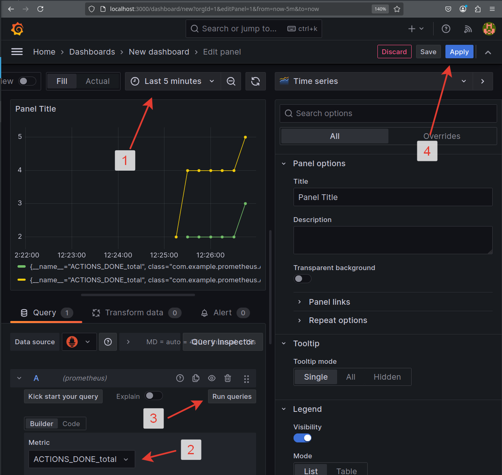

1. Первым делом выбираем промежуток времени, который нас интересует.
2. Далее выбираем метрику для вывода на график.
3. Нажимаем кнопку **Run queries** для запроса данных из Prometheus и отображения их на графике. На панели в правой части можно задать другие параметры графика, например название, описание, тип графика и т.п.
4. После того, как все нужные параметры заданы, нужно нажать кнопку **Apply** для добавление графика на дашборд.

В результате откроется дашборд со всеми созданными графиками:

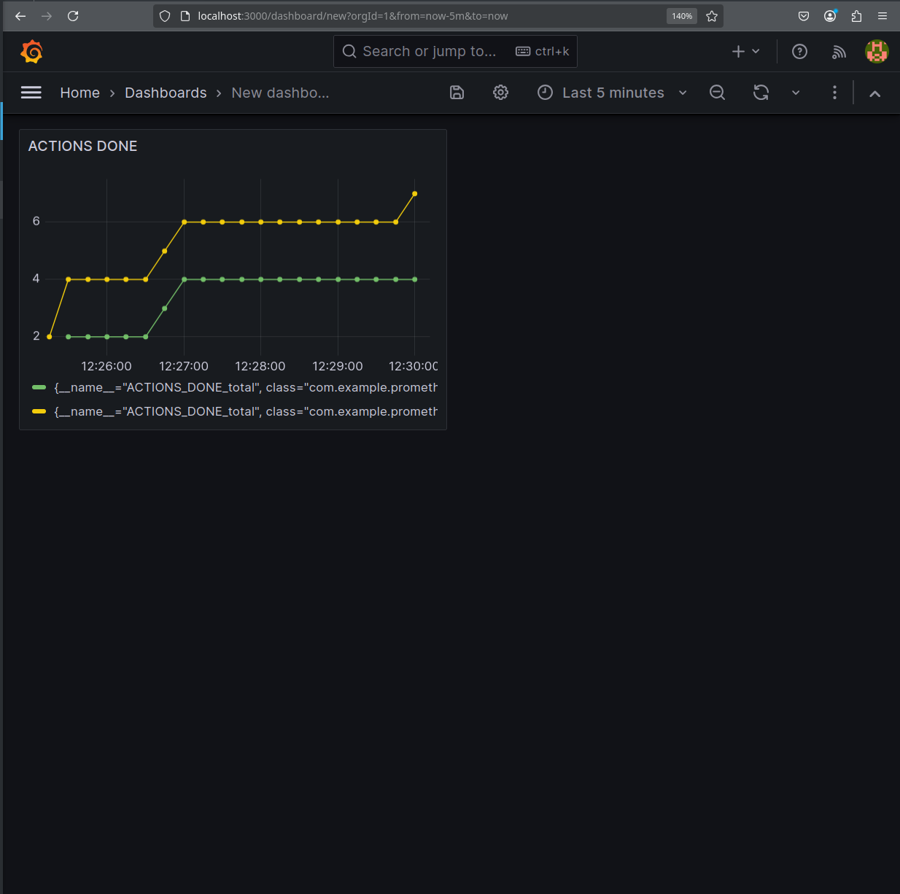

Здесь можно изменять размеры графиков, перемещать, удалять и делать другие манипуляции с графиками.

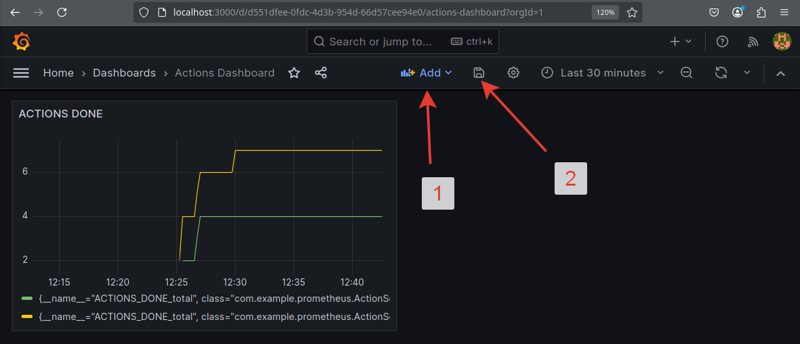

1. Для добавления ещё одного графика нужно нажать кнопку **Add** и выбрать пункт **Visualization**.
2. Для сохранения дашборда необходимо нажать на иконку сохранения. Автоматического сохранения дашборда в Grafana нет.

**ВАЖНО!!!**
Для автоматического обновления графиков в реальном времени необходимо в настройках дашборда на вкладке General выставить параметр **Refresh live dashboards** и затем выставить интервал обновления как показано на рисунке:

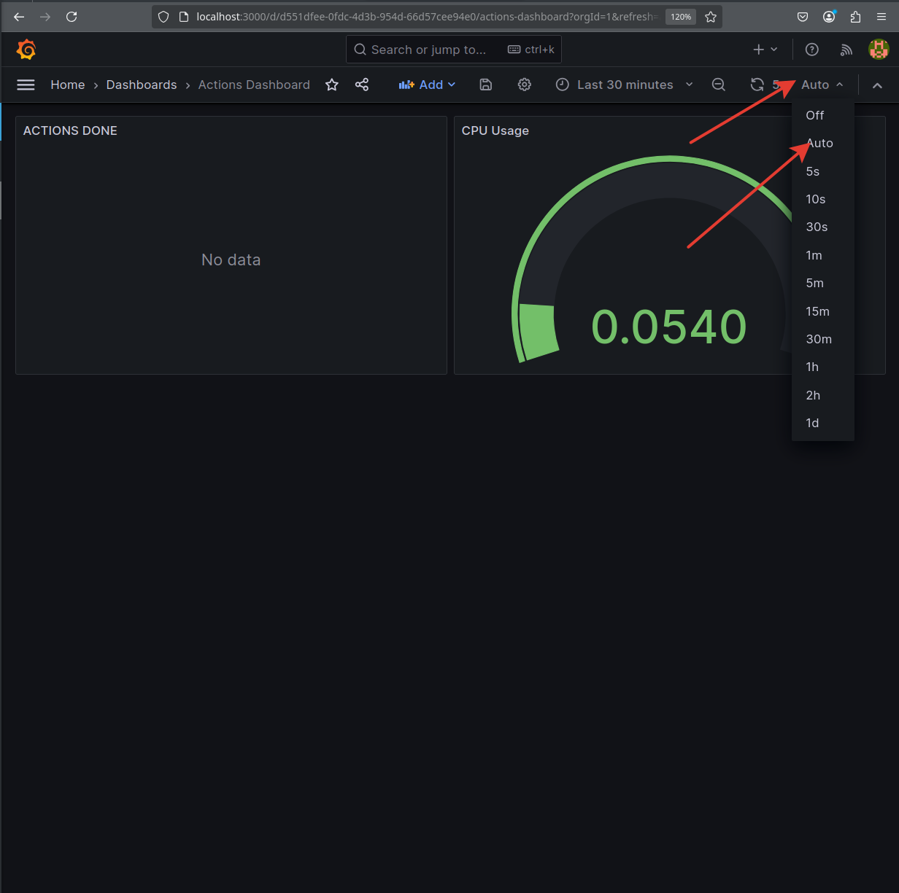

Данные запрашиваются прометеусом каждые 5 секунд, поэтому и графики будут обновляться не чаще чем через этот интервал.


### Индивидуальное задание

За основу выполнения работы нужно взять сервис из 3 или 4 лабораторной работы. К нему нужно подключить Prometheus и Grafana, настроить сбор метрик и построить интерактивный дашборд, отражающий работу веб-сервиса.

Алгоритм выполнения работы:
1. Взять код сервиса из работы 3 или 4
2. Подключить необходимые maven-зависимости
3. Настроить конфигурацию мониторинга в файле `application.properties` и создать конфигурационный файл с инициализацией аспектов
4. Добавить метрики в сервис, которые бы измеряли:
- Длительность запроса страницы данных из БД
- Длительность поиска записи в БД
- Количество добавленных записей
- Количество изменённых записей
- Количество удалённых записей
5. Проверить, что метрики выводятся по эндпоинту `/actuator/prometheus`. Для того, чтобы метрика отображалась при запросе, её значение не должно быть равно 0.
6. Настроить запуск Prometheus и Grafana в докер-контейнере
7. Проверить, что метрики сохраняются в Prometheus
8. Найти значения следующих метрик через поиск в Prometheus:
- system_cpu_usage
- logback_events_total, у которых level имеет значение debug
- http_server_requests_active_seconds_count с методом GET и статусом 200
9. Отобразить на графиках в Prometheus значения следующих метрик
- system_cpu_usage
- http_server_requests_seconds_max
- jvm_memory_used_bytes
- суммарное значение jvm_memory_used_bytes, у которых area имеет значение heap
10. Подключить Grafana к Prometheus
11. Создать в Grafana дашборд со следующими графиками (можно и нужно делать разные виды/стили/способы отображения графика):
- Все метрики из пункта 4 (для каждой метрики свой график)
- system_cpu_usage в виде стрелки (Gauge)
- jvm_memory_max_bytes area=heap в виде (Bar gauge)
- http_server_requests_seconds_count по всем URL, кроме /actuator/prometheus
- другие метрики, которые понравятся
12. Проверить, что все метрики автоматически обновляются на дашборде


### Содержание отчёта
1. Титульный лист
2. Цель работы
3. Код программы (в заголовке название файла)
4. Скрин выводимых метрик на эндпоинте `/actuator/prometheus` (не нужно в скрин вставлять все метрики)
5. Скрины с запросами метрик через графический интерфейс Prometheus (как значения метрики, так и графики)
6. Скрины построенного дашборда в Grafana.
7. Вывод