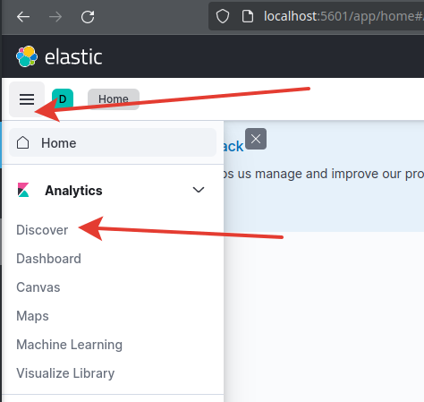

# Лабораторная работа 8
## Тема: Работа с ElasticSearch, Logstash и Kibana

**Цель:** С помощью языка программирования Java и фреймворка Spring Boot создать CRUD-приложение, логи которого будут записываться в ElasticSearch.

### 1. Создание проекта

За основу проекта можно взять веб-сервис, разработанный в процессе 3-ей лабораторной работы прошлого семеста.

### 2. Подключение библиотек

В файле `pom.xml` можно подключить библиотеку Lombok и сделать код более красивым:
```xml
<dependency>
    <groupId>org.projectlombok</groupId>
    <artifactId>lombok</artifactId>
    <optional>true</optional>
</dependency>
```
Другие необходимые зависимости:
```xml
<parent>
    <groupId>org.springframework.boot</groupId>
    <artifactId>spring-boot-starter-parent</artifactId>
    <version>3.1.4</version>
    <relativePath/>
</parent>

<dependencies>
    <dependency>
        <groupId>org.springframework.boot</groupId>
        <artifactId>spring-boot-starter-web</artifactId>
    </dependency>
    <dependency>
        <groupId>org.springframework.boot</groupId>
        <artifactId>spring-boot-starter-data-mongodb</artifactId>
    </dependency>
    <dependency>
        <groupId>org.projectlombok</groupId>
        <artifactId>lombok</artifactId>
        <optional>true</optional>
    </dependency>
    <dependency>
        <groupId>com.github.javafaker</groupId>
        <artifactId>javafaker</artifactId>
        <version>1.0.2</version>
    </dependency>
    <dependency>
        <groupId>org.springframework.boot</groupId>
        <artifactId>spring-boot-starter-test</artifactId>
        <scope>test</scope>
    </dependency>
</dependencies>
```
Не забываем добавить в конфигурацию Spring Maven Plugin исключение этой зависимости при финальной сборке проекта.
```xml
<build>
    <plugins>
        <plugin>
            <groupId>org.springframework.boot</groupId>
            <artifactId>spring-boot-maven-plugin</artifactId>
            <configuration>
                <excludes>
                    <exclude>
                        <groupId>org.projectlombok</groupId>
                        <artifactId>lombok</artifactId>
                    </exclude>
                </excludes>
            </configuration>
        </plugin>
    </plugins>
</build>
```

### 3. Причёсываем приложение

Первым делом можно причесать класс модели (в моём случае это класс `Book`) в пакете `model`. Удалим все геттеры и сеттеры и метод toString(). Конструктор так же можно удалить. Вместо всего этого поставим аннотации `@NoArgsConstructor`, `@AllArgsConstructor` и `@Data`. Класс будет выглядить таким образом:
```java
@Document(collection = "books")
@NoArgsConstructor
@AllArgsConstructor
@Data
public class Book {
    @Id
    private String id;
    private String title;
    private String author;
    private LocalDate published;
}
```
Далее переходим к репозиторию `BookRepo` в пакете `repo`. Удалим из него все ненужные методы, которые мы не используем. В результате будет пустой интерфейс, в котором от родительских интерфейсов остануться методы по умолчанию.
```java
@Repository
public interface BooksRepository extends MongoRepository<Book, String> {}
```
После этого можем переместиться в `BookService` в пакете `service` и удалить все неиспользуемые методы. В результате должны остаться только следующие методы:
```java
public interface BooksService {
    Book createBook(Book book);
    Book getBook(String id);
    void deleteBook(String id);
    void saveAllBooks(List<Book> books);
    Page<Book> getBooks(Pageable pageable);
}
```
Из `BookServiceImpl` тоже все ненужные методы надо удалить. Конструктор тоже удаляем, а аннотацию `@Autowired` помещаем над полем для внедрения зависимости.
```java
@Service
public class BooksServiceImpl implements BooksService {
    @Autowired
    private BooksRepository booksRepo;

    @Override
    public Book createBook(Book book) {
        booksRepo.save(book);
        return book;
    }

    @Override
    public Page<Book> getBooks(Pageable pageable) {
        Page<Book> books = booksRepo.findAll(pageable);
        return books;
    }

    @Override
    public Book getBook(String id) {
        return booksRepo.findById(id)
                .orElseThrow(() -> new RuntimeException("Книга с id=" + id + " не найдена"));
    }

    @Override
    public void deleteBook(String id) {
        booksRepo.deleteById(id);
    }

    @Override
    public void saveAllBooks(List<Book> books) {
        booksRepo.saveAll(books);
    }
}
```
Для контроллера добавляем аннотацию `@CrossOrigin`, которая позволит через графический интерфейс обращаться к REST-контроллеру.
```java
@RestController
@CrossOrigin
public class BooksController {
    @Autowired
    private BooksService booksService;

    @GetMapping("/books")
    public Page<Book> getBooksPage(
            @RequestParam(defaultValue = "0") Integer offset,              // Номер страницы
            @RequestParam(defaultValue = "10") Integer limit     // Количество элементов на странице
    ) {
        return booksService.getBooks(PageRequest.of(offset, limit));
    }

    @GetMapping("/books/{id}")
    public Book getBooks(@PathVariable String id) {
        return booksService.getBook(id);
    }

    @PostMapping("/books")
    public Book postBook(@RequestBody Book book) {
        return booksService.createBook(book);
    }

    @DeleteMapping("/books/{id}")
    public void deleteBook(@PathVariable String id) {
        booksService.deleteBook(id);
    }

    @PutMapping("/books/{id}")
    public Book putBook(@RequestBody Book newBook, @PathVariable String id) {
        newBook.setId(id);
        return booksService.createBook(newBook);
    }
}
```
Для того, чтобы при запуске приложения база данных заполнялась значениями, создадим пакет `runner` и в нём класс `GenerateBooks`, в котором с помощью библиотеки Java Faker будем задавать значения для наших объектов.
```java
@Component
public class GenerateBooks implements CommandLineRunner {
    private static final int LIST_SIZE = 1000;
    private static final SimpleDateFormat formatter = new SimpleDateFormat("yyyy-MM-dd");
    @Autowired
    private BooksService booksService;

    @Override
    public void run(String... args) throws Exception {
        booksService.saveAllBooks(generateBooks());
    }

    private List<Book> generateBooks() throws ParseException {
        Faker faker = new Faker();
        List<Book> books = new ArrayList<>(LIST_SIZE);
        for (int i=0; i<LIST_SIZE; i++) {
            books.add(new Book(
                    null,
                    faker.book().title(),
                    faker.book().author(),
                    toLocalDate(faker.date().between(
                        formatter.parse("1900-01-01"),
                        formatter.parse("2000-01-01"))
                    )
            ));
        }
        return books;
    }

    private LocalDate toLocalDate(Date date) {
        return date.toInstant().atZone(ZoneId.systemDefault()).toLocalDate();
    }
}
```
Для подключения графического REST-интерфейса к приложению создадим пакет `config` и в нём класс `MvcConfig`. В нём зададим следующую конфигурацию для Spring:
```java
@Configuration
public class MvcConfig implements WebMvcConfigurer {
    @Override
    public void addResourceHandlers(ResourceHandlerRegistry registry) {
        registry.addResourceHandler("/").addResourceLocations("classpath:/static/index.html");
        registry.addResourceHandler("/**").addResourceLocations("classpath:/static/");
    }
}
```
Переместим файлы графического интерфейса в `elastic-service/src/main/resources/static`. (elastic-service - это название проекта, у вас может быть другое).

### 4. Конфигурация логгирования сервиса

Для получения информации о запросах к сервису в логах необходимо добавить ещё две зависимости в файл `pom.xml`:
```xml
<dependency>
    <groupId>org.zalando</groupId>
    <artifactId>logbook-spring-boot-starter</artifactId>
    <version>3.7.1</version>
</dependency>
<dependency>
    <groupId>net.logstash.logback</groupId>
    <artifactId>logstash-logback-encoder</artifactId>
    <version>6.6</version>
</dependency>
```
По умполчанию логи сервиса выводятся в консоль. В файле `logback-spring.xml` Можно настроить вывод логов для сохранения их в текстовый файл или отправки на удалённый сервер. Создадим этот файл в папке `elastic-service/src/main/resources` и вставим туда следующую конфигурацию:
```xml
<configuration>
    <include resource="org/springframework/boot/logging/logback/defaults.xml"/>
    <include resource="org/springframework/boot/logging/logback/console-appender.xml"/>

    <appender name="LOGSTASH" class="net.logstash.logback.appender.LogstashTcpSocketAppender">
        <destination>localhost:4560</destination>
        <encoder class="net.logstash.logback.encoder.LogstashEncoder"/>
    </appender>

    <root level="INFO">org.zalando.logbook.Logbook
        <appender-ref ref="CONSOLE"/>
    </root>
    <logger name="org.zalando.logbook.Logbook" level="TRACE">
        <appender-ref ref="LOGSTASH"/>
    </logger>
</configuration>
```
В сервисный слой нашего приложения (класс `BookService`) добавим вывод логов. Для этого добавим аннотацию `@Slf4j` над классом. Во время выполнения каждого из действий сервиса добавим вывод логов уровня INFO. Должно получиться что-то вроде этого:
```java
@Slf4j
@Service
public class BooksServiceImpl implements BooksService {
    @Autowired
    private BooksRepository booksRepo;

    @Override
    public Book createBook(Book book) {
        Book newBook = booksRepo.save(book);
        log.info("Book created: {}", newBook);
        return newBook;
    }

    @Override
    public Page<Book> getBooks(Pageable pageable) {
        Page<Book> books = booksRepo.findAll(pageable);
        log.info("All books requested");
        return books;
    }

    @Override
    public Book getBook(String id) {
        Book requestedBook = booksRepo.findById(id)
                .orElseThrow(() -> new RuntimeException("Книга с id=" + id + " не найдена"));
        log.info("Book requested: {}", requestedBook);
        return requestedBook;
    }

    @Override
    public void deleteBook(String id) {
        log.info("Deleted book by id: {}", id);
        booksRepo.deleteById(id);
    }

    @Override
    public void saveAllBooks(List<Book> books) {
        log.info("Saved collection of books");
        booksRepo.saveAll(books);
    }
}
```
Для запуска сервиса необходимо запустить образ mongodb в Docker. Для этого создадим папку `docker` в корне проекта. В ней создадим папку `mongo`. Туда поместим файл `docker-compose.yml` со следующим содержимым.
```yml
version: "3.7"

services:
  mongodb:
    image: mongo:latest
    container_name: mongodb
    restart: always
    environment:
      - MONGO_INITDB_ROOT_USERNAME=root
      - MONGO_INITDB_ROOT_PASSWORD=example
    ports:
      - "27017:27017"
```
Теперь можно запустить mongodb (через docker compose или черещ docker plugin для IDEA) и сервис и проверить, что вывод логов в консоль работает.
Важно при запуске закомментировать в файле `logback-spring.xml` строчки (<!-- --> - многострочный комментарий):
```xml
<!--
    <logger name="org.zalando.logbook.Logbook" level="TRACE">
        <appender-ref ref="LOGSTASH"/>
    </logger> 
-->
```


### 5. Конфигурация Elastic

Elasic будет состоять из 3х компонентов:
- Logstash - сервис по сбору логов;
- ElasticSearch - NoSql хранилище данных и поисковый движок;
- Kibana - графический интерфейс для Elastic.

В папке `docker` нашего проекта создадим папку `elastic`. Туда добавим файл `docker-compose.yml` со следующим содержимым:
```yml
version: "3.7"

services:
  elasticsearch:
    image: elasticsearch:8.4.3
    container_name: elasticsearch
    environment:
      - node.name=elasticsearch
      - xpack.security.enabled=false
      - xpack.security.authc.api_key.enabled=false
      - discovery.type=single-node
      - bootstrap.memory_lock=true
      - "ES_JAVA_OPTS=-Xms512m -Xmx512m"
    ports:
      - "9200:9200"
      - "9300:9300"
    healthcheck:
      test: ["CMD-SHELL", "curl --silent --fail localhost:9200/_cluster/health || exit 1"]
      interval: 10s
      timeout: 10s
      retries: 3
    networks:
      - elastic

  logstash:
    image: logstash:8.4.3
    container_name: logstash
    environment:
      discovery.seed_hosts: logstash
      LS_JAVA_OPTS: "-Xms512m -Xmx512m"
    volumes:
      - ./logstash/logstash.conf:/usr/share/logstash/logstash.conf
    command: logstash -f /usr/share/logstash/logstash.conf
    ports:
      - "5000:5000/tcp"
      - "5000:5000/udp"
      - "5044:5044"
      - "9600:9600"
      - "4560:4560"
    depends_on:
      - elasticsearch
    networks:
      - elastic

  kibana:
    image: kibana:8.4.3
    container_name: kibana
    environment:
      - ELASTICSEARCH_HOSTS=http://elasticsearch:9200
    ports:
      - "5601:5601"
    depends_on:
      - elasticsearch
    networks:
      - elastic

networks:
  elastic:
    driver: bridge
```
В этом файле описана конфигурация запуска всех трёх компонентов Elastic. Теперь в той же папке `elastic` нужно создать папку `logstash` и в ней создать файл `logstash.conf`. В этом файле будет описана конфигурация для `logstash`(откуда брать логи, как их преобразовывать и куда их передавать). Содержимое этого файла будет следующим:
```
input {
    tcp {
        port => 4560
        codec => json
    }
}

filter {
    json {
        source => "message"
        skip_on_invalid_json => true
    }
    mutate {
        remove_field => [ "body" ]
    }
}

output {
    stdout {
        codec => rubydebug
    }

    elasticsearch {
        hosts => ["elasticsearch:9200"]
        index => "service-logs"
    }
}
```
Теперь можно запустить файл `docker-compose.yml` из папки `elastic`. 

### 6. Просмотр логов сервиса в Kibana

Переходим в графический интерфейс Kibana по адресу `localhost:5601`. Откроется стартовая страница Kibana.


Далее необходимо открыть меню и перейти на вкладку Discover.


Нажимаем кнопку Create data view


Заполняем форму следующими данными и нажимаем кнопку сохранения:
- Name - название отображаемого data view;
- Index pattern - метка сервиса, логи которого будут отображаться в data view. Она указывается в файле logstash.conf в параметре index;
- Timestamp field - выбор поля по которому будет сортироваться время.


После создания нового data view откроется следующая страница с логами.

 
 Если логи не отобразились, следует выбрать другой временной промежуток (например последние 15 часов) и нажать на кнопку Refresh.


 ### Индивидуальное задание

- Сделать по вышеописанному примеру программу со своей предметной областью
- Сделать запросы к веб-сервису по несколько штук со следующими запросами
    - на добавление данных
    - на обновление данных
    - на получение данных
    - на удаление данных
    - ошибочный (по несуществующему пути)
- Запустить Kibana и создать новый Data View
- Настроить фильтры в Kibana чтобы отображались запросы по следующим параметрам (нужно сделать все пункты):
    1. Отобразить все поля timestamp и message тех запросов, у которых url не пустой;
    2. Отобразить все записи, у которых origin=remote;
    3. Отобразить поля timestamp, status, origin, thread_name и message для тех запросов, у которых origin=local или status=200, либо 201, либо 404.


### Содержание отчёта

1. Титульный лист
2. Цель работы
3. Код программы (в заголовке название файла)
4. Скрины демонстрации работы программы:
    - операции получения, добавления, удаления и изменения данных через графический интерфейс или через POSTMAN;
    - логи этих операций в консоли;
    - запущенный графический интерфейс Kibana;
    - полученный список логов по настроенным фильтрам согласно заданию.
5. Пояснения по поводу процесса обработки сообщения (что откуда куда передаётся и где сохраняется)
6. Вывод